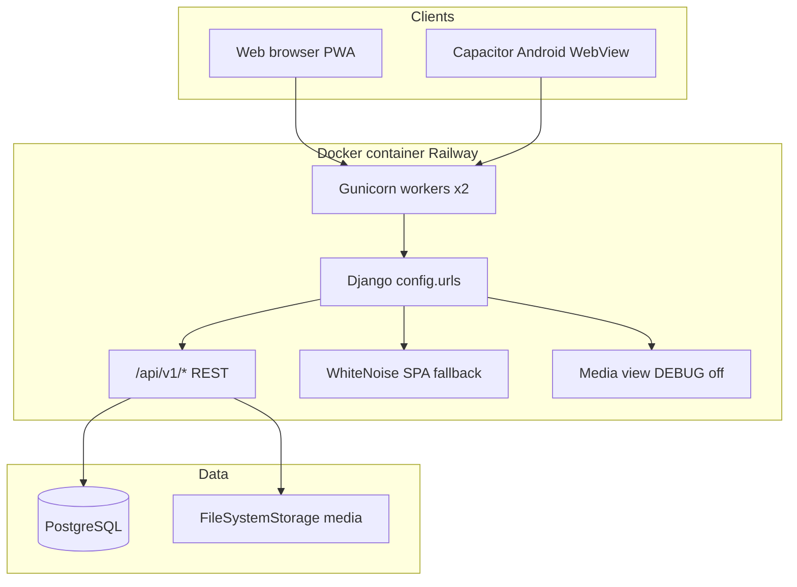
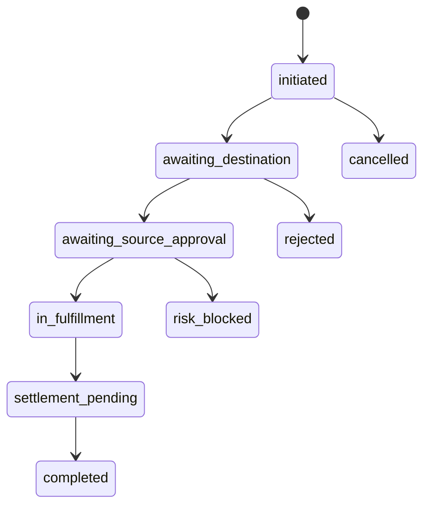
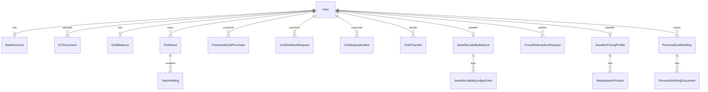

# Cridora India — Complete System Documentation (Single File)

**Audit date:** 2026-05-19  
**Repository:** cridoraindia  
**Basis:** Implemented code only — no assumed DPR/planned features.

---

## Table of contents

1. [Project overview & health](#part-1--project-overview--health)
2. [System architecture](#part-2--system-architecture)
3. [User types & authentication](#part-3--user-types--authentication)
4. [User flows](#part-4--user-flows)
5. [Feature status report](#part-5--feature-status-report)
6. [Database report](#part-6--database-report)
7. [API report](#part-7--api-report)
8. [UI/UX structure](#part-8--uiux-structure)
9. [Notifications, realtime & performance](#part-9--notifications-realtime--performance)
10. [Security & risk](#part-10--security--risk)
11. [Deployment & environment](#part-11--deployment--environment)
12. [Pending tasks](#part-12--pending-tasks)
13. [Project summary (JSON)](#part-13--project-summary-json)

---


---

# PART 1 — PROJECT OVERVIEW & HEALTH

## Section 1 — Project overview

### What Cridora currently is

Cridora India is a **jewellery-linked digital gold platform** for the Indian market. The live implementation centers on:

1. **Custodial gold vaults** — per-customer vaults held at verified jeweller custodians.
2. **Fractional gold purchase** — customers buy grams at jeweller counter or via manual UPI + UTR.
3. **Physical gold deposit** — jeweller records intake; customer confirms via counter OTP.
4. **Sellback (cash redemption)** — customer sells vault grams back to jeweller (cash OTP or UPI payout).
5. **GoldUPI** — P2P gram transfers between customers (`handle@jewellercode`, routing codes).
6. **Marketplace** — jeweller SKU catalog, live/managed gold ticker, ornament redemption from vault.
7. **Cross-redemption** — emergency cross-jeweller redemption saga with exposure limits and manual settlement MVP.
8. **Personal holdings vault** — off-platform gold tracking (documents only; not redeemable in MVP).
9. **KYC/KYB** — document upload + admin approval workflows.

This is **not** a full banking or payment-aggregator product yet. Payments are **manual UPI + UTR confirmation** or **in-person counter OTP** — no Razorpay/Stripe/Cashfree integration in code.

### Current MVP direction (as implemented)

- Single monolithic deploy: Django serves API + static React SPA.
- Three roles: **customer**, **jeweller**, **admin** (no separate “super admin” type; Django `is_superuser` syncs to platform admin).
- Verification gates: many money flows require `kyc_status == verified`.
- Jeweller marketplace is **real API-backed** with optional **demo listings** merged in UI for empty states.
- Nationwide automated settlement is **deferred** — `SettlementBatch` / obligations exist; admin UI shows “Coming soon”.

### Architecture approach

```
Browser / Capacitor WebView
        │  HTTPS (JWT Bearer)
        ▼
┌───────────────────────────────────────┐
│  Gunicorn → Django 5                  │
│  • REST /api/v1/*                     │
│  • WhiteNoise → frontend/dist (SPA)   │
│  • FileSystemStorage → /media (KYC)    │
└───────────────────────────────────────┘
        │
        ▼
   PostgreSQL (Railway)
```

### Technology stack (actual)

| Layer | Technology |
|-------|------------|
| Frontend | React 18.3, Vite 6, TypeScript ~5.6, React Router 6 |
| State | React Context (`AuthContext`, `ThemeContext`) — no Redux/React Query |
| Styling | Custom CSS (`src/styles/index.css`) — no component library |
| Backend | Django 5, DRF, SimpleJWT + token blacklist |
| DB | PostgreSQL via `dj-database-url`; SQLite if no `DATABASE_URL` |
| Auth | Email/password → JWT (access 8h, refresh 14d, rotate + blacklist) |
| Static/media | WhiteNoise + `FileSystemStorage` |
| PWA | `vite-plugin-pwa`, custom Workbox `src/sw.ts` |
| Native | Capacitor 7 Android (`in.cridora.app`) |
| Push | `pywebpush` (VAPID) + `firebase-admin` (FCM) |

### Project maturity (evidence-based)

| Dimension | Assessment |
|-----------|------------|
| Core gold wallet flows | **Operational** — fractional, deposit, sellback, transfer |
| Marketplace | **Operational** — catalog, ticker, jeweller admin, moderation |
| Cross-redemption | **Operational in-app** — saga + manual settlement; no bank rails |
| Golden scheme / loans | **Not implemented** (UI placeholders; scheme fields are disclosure-only on storefront) |
| Payments | **Manual** — UTR workflows; card checkout is demo-only in UI |
| CI/CD | **None** in repository |
| Automated tests | **Limited** — ~11 test modules under `accounts/tests` |

**Overall:** Strong **MVP demo/production pilot** for jeweller–customer gold operations; **not** production-ready for regulated payments at scale without gateway, SMS OTP, rate limits, and settlement automation.

---

## Section 2 — User types & role system

| Role | `user_type` | Dashboard route | Platform admin check |
|------|-------------|-----------------|----------------------|
| Public visitor | — | Public pages | — |
| Customer | `customer` | `/userdashboard?section=` | — |
| Jeweller | `jeweller` | `/dashboard/jeweller?section=` | — |
| Admin | `admin` | `/dashboard/admin?section=` | `user_type==admin` OR (`is_superuser` AND `is_staff`) |

**Not implemented:** Staff/subaccounts, jeweller employees, granular Django permissions per endpoint. Authorization is **inline role checks** in views.

**Jeweller preferences (customer):** `default_jeweller`, `jeweller_pref_nearby`, `jeweller_pref_ornament`, `jeweller_pref_redemption` — backend fields exist; UI “set default jeweller” on marketplace grid is **coming soon**.

---

## Section 3 — Authentication system

| Capability | Status |
|------------|--------|
| Customer signup (`POST /auth/register/`) | **IMPLEMENTED** |
| Jeweller apply (`POST /auth/jeweller/apply/`) | **IMPLEMENTED** |
| Login → JWT | **IMPLEMENTED** |
| Refresh + logout blacklist | **IMPLEMENTED** |
| Password change | **IMPLEMENTED** |
| Session cookies for API | **NOT USED** — JWT only |
| SMS/phone OTP login | **MODEL ONLY** (`PhoneOTPChallenge`) — no API |
| Email verification | **NOT IMPLEMENTED** |
| Password reset email | **NOT IMPLEMENTED** |
| KYC upload + admin approve | **IMPLEMENTED** |
| Role assignment | **At registration**; admin via Django superuser sync |

**Frontend:** Tokens in `localStorage`; bootstrap restores cached user without mandatory `/auth/me/` on load. `authFetch` refreshes on 401.

**Onboarding redirects:** `/onboarding/kyc` → customer KYC section; `/onboarding/jeweller-kyb` → jeweller KYB section.

---

## Section 20 — Final system health report

### Readiness scores (code-evidence estimates)

| Metric | % | Rationale |
|--------|---|-----------|
| MVP readiness | **68** | Core gold + marketplace + KYC work end-to-end with manual payments |
| Production readiness | **48** | No payment gateway, limited tests, no CI, stub outbox/settlement |
| UI completion | **74** | Full dashboard shells; 5+ explicit Coming Soon sections |
| Backend completion | **72** | ~120 REST endpoints; gaps in loans/schemes/SMS OTP |
| Security readiness | **52** | JWT solid; missing rate limits, reset flow, some AllowAny endpoints |
| Scalability readiness | **55** | Monolith OK early; saga/outbox patterns started but not production-grade |

### Biggest risks

1. **Financial reconciliation** relies on manual UTR and jeweller honesty — no PSP webhooks.
2. **Cross-redemption settlement** is MVP manual (`settlement-complete` admin action).
3. **Integration outbox** marks done without external I/O.
4. **No API rate limiting** — OTP brute-force surface.
5. **Guest notification bell** uses mock data (confusing for demos).

### Strongest implemented modules

- Fractional purchase + jeweller verify (counter OTP + UPI path)
- Gold sellback + UPI payout path
- Gold deposit intake + counter OTP
- Vault / GoldUPI / transfers
- Marketplace catalog + gold ticker + admin moderation
- Cross-redemption state machine + jeweller inbox
- Admin KYC/KYB review modal

### Weakest areas

- Golden scheme customer enrollment
- Gold loans
- Admin treasury/settlements UI
- Payment gateway / card checkout
- SMS authentication
- Automated inter-jeweller settlement

### Recommended next development order

1. Payment gateway + webhook reconciliation (fractional + marketplace checkout).
2. Wire `CustomerVaultRedemptionShopPanel` or remove dead code; complete vault ornament redemption UX.
3. Rate limiting + OTP hardening + password reset.
4. Replace integration outbox stub; operationalize settlement batches.
5. Golden scheme MVP (enrollment + ledger) or hide jeweller disclosure until ready.
6. CI pipeline + expand integration tests.
7. Remove or gate demo catalog merges in production builds.

---

*This master document is the entry point. All claims trace to files under `backend/` and `frontend/` as of audit date.*


---

# PART 3 — USER TYPES & AUTHENTICATION

## User types

| Role | user_type | Dashboard | Admin check |
|------|-----------|-----------|-------------|
| Public visitor | — | Public pages | — |
| Customer | customer | /userdashboard?section= | — |
| Jeweller | jeweller | /dashboard/jeweller?section= | — |
| Admin | admin | /dashboard/admin?section= | user_type==admin OR (is_superuser AND is_staff) |

**Not implemented:** Staff/subaccounts, jeweller employees, granular Django permissions. Authorization uses inline role checks in views.

**Jeweller preferences:** default_jeweller, jeweller_pref_nearby, jeweller_pref_ornament, jeweller_pref_redemption — backend ready; UI set-default coming soon.

## Authentication

| Capability | Status |
|------------|--------|
| Customer signup | IMPLEMENTED |
| Jeweller apply | IMPLEMENTED |
| Login JWT | IMPLEMENTED |
| Refresh + logout blacklist | IMPLEMENTED |
| Password change | IMPLEMENTED |
| Session cookies for API | NOT USED |
| SMS phone OTP | MODEL ONLY (PhoneOTPChallenge) |
| Email verification | NOT IMPLEMENTED |
| Password reset | NOT IMPLEMENTED |
| KYC + admin approve | IMPLEMENTED |

Frontend: tokens in localStorage; authFetch refreshes on 401. Onboarding: /onboarding/kyc, /onboarding/jeweller-kyb.


---

---

## 1. High-level topology



---

## 2. Backend structure

### 2.1 Django project (`backend/config/`)

| File | Role |
|------|------|
| `settings.py` | DB, JWT, CORS, media, VAPID, Firebase |
| `urls.py` | `/api/v1/` includes, `/admin/`, SPA catch-all, `/media/` |
| `views.py` | `spa_index` — serves `index.html` for non-API routes |
| `wsgi.py` | Gunicorn entry |

### 2.2 Apps

#### `apps.accounts` (core domain)

**Responsibilities:** Users, KYC/KYB, vault, fractional/sellback/deposit, cross-redemption saga, personal portfolio, notifications, push subscriptions.

**Layering pattern:**

```
views*.py / *_views.py  →  thin APIView
        ↓
*_service.py, services/*  →  business logic, transactions
        ↓
models.py  →  persistence
```

**No `selectors/` layer** — ORM queries live in services/views.

**Key service packages:**

| Path | Purpose |
|------|---------|
| `vault_service.py` | Vault creation, holdings, balance sync |
| `fractional_service.py` | Quote, order, completion |
| `sellback_service.py` | Sellback lifecycle |
| `gold_deposit_completion.py` | Deposit vault credit |
| `jeweller_liability_service.py` | Custodial liability ledger |
| `services/cross_redemption/*` | Saga, transitions, limits, outbox (stub) |
| `services/personal_holdings.py` | Off-vault holdings |
| `services/kyc_review.py` | Admin review helpers |
| `webpush_service.py`, `fcm_service.py` | Push delivery |

#### `apps.marketplace`

**Responsibilities:** Gold ticker, spot price fetch/cache, metal purities, product catalog, jeweller pricing profiles, vault ornament redemption pricing.

| Module | Purpose |
|--------|---------|
| `spot_prices.py` | External XAU/USD-INR fetch + cache |
| `metal_pricing.py`, `pricing.py` | SKU price computation |
| `redemption_views.py` | Quote/confirm vault redemption |
| `redemption_cross_bridge.py` | Link to cross-redemption when needed |
| `gold_rate_alerts.py` | Threshold push cron |
| `gold_hourly_push.py` | Hourly rate push cron |

### 2.3 Migrations

| App | Count | Range |
|-----|-------|-------|
| accounts | 30 | `0001_initial` … `0030_sellback_upi` |
| marketplace | 24 | `0001_initial` … `0024_jewellerpricingprofile_upi_vpa` |

---

## 3. Frontend structure

```
frontend/src/
├── App.tsx                 # Router only
├── main.tsx                # PWA register, providers
├── context/                # AuthContext, ThemeContext
├── pages/                  # Route-level pages
├── pages/dashboard/        # Role dashboards (section-driven)
├── features/               # Domain UI modules
├── components/             # Layout, chrome, shared UI
├── lib/                    # API clients, nav config, utilities
└── styles/index.css        # Global design system
```

**Routing model:** Few React Router paths; dashboards use **`?section=<key>`** query param with nav configs in `src/lib/mobileNav/`.

**Build modes:**

| Mode | Router | `base` | Notes |
|------|--------|--------|-------|
| Web dev | BrowserRouter | `/` | Vite proxy `/api` → :8000 |
| Web prod | BrowserRouter | `/` | `VITE_API_BASE_URL` baked in |
| Capacitor | HashRouter | `./` | `VITE_CAPACITOR_BUILD=true` |

---

## 4. Authentication architecture

```
Login/Register
     → access_token + refresh_token (JSON)
     → localStorage
     → Authorization: Bearer on authFetch
     → 401 → POST /auth/token/refresh/ → retry once
Logout → blacklist refresh token
```

**Not used for API:** Django session cookies (sessions exist for `/admin/` only).

---

## 5. Realtime & polling

| Feature | Mechanism | Realtime? |
|---------|-----------|-----------|
| Gold ticker / spot prices | HTTP fetch; cron updates DB | **Static/polled** — client refetch on navigation |
| Dashboard wallet | `GET /gold/wallet/`, `/auth/me/` | **Poll on focus/interval** in panels — no WebSocket |
| Notifications (logged in) | `GET /notifications/` or `/admin/notifications/` | **Poll** when bell opens |
| Cross-redemption status | REST + jeweller heartbeat endpoint | **Semi-realtime** — heartbeat POST, not WS |
| Web Push / FCM | Server push on events | **Push** when subscribed |
| Gold rate alerts | Management command cron | **Batch** |

**No WebSocket implementation** in codebase.

---

## 6. Notification architecture

```
Event (signal/service)
    → AdminNotification / PortfolioUserNotification / push payload
    → Optional: webpush_service / fcm_service
    → Client: NotificationBell polls API OR mock (guest)
```

| Feed | API | When |
|------|-----|------|
| Customer/jeweller platform | `GET /api/v1/notifications/` | Authenticated |
| Admin | `GET /api/v1/admin/notifications/` | Platform admin |
| Guest/public header | `mockNotifications.ts` | **Not live** |

**Festival broadcasts:** `FestivalBroadcastNotification` + `process_festival_broadcasts` cron.

---

## 7. Cross-redemption saga (architectural)



- **ExposureReservation** holds INR exposure during flow.
- **CrossRedemptionSagaStep** tracks idempotent steps.
- **IntegrationOutbox** — **STUB** (marks DONE without HTTP).
- **SettlementObligation** — manual MVP completion via admin API + management command.

---

## 8. External integrations (actual)

| Integration | Status |
|-------------|--------|
| PostgreSQL | Production |
| Spot price APIs | Used in `spot_prices.py` (cached) |
| Web Push (VAPID) | Optional env keys |
| Firebase FCM | Optional `FIREBASE_SERVICE_ACCOUNT_JSON` |
| Payment gateway | **None** |
| SMS OTP provider | **None** |
| Email (SMTP) | **None** in settings |
| Jeweller external gold API URL | Field stored, **not fetched** |

---

## 9. Code quality & maintainability

### Strengths

- Clear split `accounts` vs `marketplace`.
- Service modules for complex flows (fractional, sellback, cross-redemption).
- Frontend feature folders mirror domains.
- Legacy section key maps preserve old URLs.

### Technical debt

| Issue | Location |
|-------|----------|
| No shared DRF permission classes | All views use inline checks |
| Demo data merged in production UI | `*MarketplaceDemos.ts` |
| Dead component | `CustomerVaultRedemptionShopPanel` not routed |
| Large dashboard page files | `AdminDashboardPage.tsx` (~900+ lines) |
| No React Query | Manual fetch/error state per panel |
| Duplicate path casing in workspace | `cridoraindia` vs `corridoraindia` folder names |

### Test coverage

`backend/apps/accounts/tests/` — auth, fractional UPI, sellback UPI, cross-redemption tiers, redemption bridge, admin discretionary, MVP alignment. **No marketplace app tests found.**

---

## 10. Management commands (operations)

| Command | Purpose |
|---------|---------|
| `create_cridora_superadmin` | Bootstrap admin user |
| `seed_test_users` | Demo data (dev) |
| `generate_vapid_keys` | Web Push keys |
| `process_festival_broadcasts` | Scheduled push sends |
| `run_gold_rate_alerts` | Rate threshold notifications |
| `run_hourly_gold_push` | Hourly gold push |
| `cross_redemption_timeout_sweep` | Expire stale requests |
| `cross_redemption_recover_sagas` | Saga recovery |
| `cross_redemption_process_outbox` | Outbox stub processor |
| `cross_redemption_run_settlement_mvp` | MVP settlement batch |

Documented for Railway Cron: gold alerts, festival broadcasts, hourly push.

---

*See API_REPORT.md and DATABASE_REPORT.md for endpoint and schema detail.*


---

---

## Public visitor flows

### Browse marketing site ✅

1. Land on `/` (HomePage) within `PublicLayout`.
2. Navigate via top nav or mobile bottom bar: Discover, Shop, Join, Account.
3. Pages: `/why-cridora`, `/features`, `/how-it-works`, `/investors`, `/waitlist` (mailto only — ❌ no API).

### Browse jewellers & marketplace ✅

1. `/jewellers` — directory from `GET /api/v1/marketplace/jewellers/` (+ demo merge in UI).
2. `/jewellers/:id` — public storefront profile.
3. `/marketplace` — product catalog; demo SKUs blocked at checkout.
4. `/marketplace/product/:productId` — detail page.

### Sign up / log in ✅

1. `/signup` → `POST /auth/register/` (customer).
2. `/jeweller/apply` → `POST /auth/jeweller/apply/`.
3. `/login` → `POST /auth/login/` → JWT stored → redirect by role.

---

## Customer flows

**Dashboard:** `/userdashboard?section=<key>`  
**Default section:** `portfolio_overview`

### Signup & onboarding ✅

1. Register at `/signup` with email, password, name, phone.
2. Redirect to `/userdashboard` or `?section=profile_kyc` if `kyc_status != verified`.
3. `/onboarding/kyc` alias redirects to KYC section.

### KYC ⚠️ (no automated verification)

1. Open **Profile → KYC** (`profile_kyc`).
2. `CustomerKycWorkflow`: upload docs via `POST /kyc/documents/upload/` (aadhaar, pan, selfie).
3. Optional: `POST /kyc/bank/` for bank account.
4. Wait for admin approval (`users_kyc_kyb` queue).
5. Until verified: fractional purchase, sellback, vault redemption **blocked** by API.

### Default jeweller ⚠️

- Backend: `GET/PATCH /gold/default-jeweller/`, jeweller preference FKs on User.
- UI: marketplace “Set default jeweller” — **coming soon** on grid.
- GoldUPI identity: `GET/PATCH /gold/identity/`.

### Buy fractional gold ✅

**Section:** `invest_fractional`

1. Select jeweller (verified).
2. `POST /fractional/quote/` — amount/grams, rate, GST.
3. `POST /fractional/orders/` — create order.
4. **Path A — Counter:** `POST .../counter-otp/` → jeweller enters OTP → `POST /jeweller/fractional/orders/:id/verify/`.
5. **Path B — UPI:** `POST .../confirm-upi/` → customer pays → `POST .../submit-utr/` → jeweller `confirm-utr`.
6. Completion credits `VaultHolding` (fractional) + jeweller liability ledger.

### Gold deposit (customer view) ✅

**Section:** `invest_deposit` (info) + jeweller initiates intake

1. Jeweller creates intake → customer sees `GET /gold-deposit/intakes/`.
2. Customer requests `POST .../counter-otp/`.
3. Jeweller verifies → vault credited.

### Golden scheme ❌

**Section:** `invest_scheme` — **Coming Soon** UI only.  
Jeweller can disclose scheme on storefront (backend fields on `JewellerPricingProfile`); no customer enrollment API.

### Portfolio viewing ✅

| Section | Panel | APIs |
|---------|-------|------|
| `portfolio_overview` | CustomerPortfolioPanel | `/gold/wallet/`, portfolio helpers |
| `portfolio_holdings` | Vault breakdown | wallet |
| `portfolio_vault_ids` | Cridora ID, routing, QR | identity, wallet |

**Personal holdings** (off-vault): accessible via portfolio features — `GET/POST /portfolio/personal-holdings/` (tracking only, not redeemable).

### Transfer gold (GoldUPI) ✅

**Section:** `redeem_transfer`

1. Resolve payee: `POST /gold/resolve/` or scan QR (`GoldTransferMobileFlow`).
2. `POST /gold/transfers/` — debit/credit vaults.
3. Public meta: `GET /gold/pay/<gold_upi>/` (AllowAny).

### Cash sellback (redeem) ✅

**Section:** `redeem_cash`

1. `POST /gold/sellback/quote/`.
2. `POST /gold/sellback/confirm/` — creates request.
3. Jeweller accept → cash OTP or UPI payout path.
4. Customer confirms UTR or OTP; vault debited.

### Cross redemption (emergency) ✅

**Section:** `redeem_emergency`

1. Customer authorizes: `POST /cross-redemption/authorize/`.
2. Track: `GET /cross-redemption/`.
3. Cancel: `POST /cross-redemption/:id/cancel/`.
4. Jeweller destination accept/reject; source OTP approve.
5. Settlement completed manually by admin.

### Vault ornament redemption (shop from vault) ⚠️

- Backend: `POST /marketplace/redemption/quote|confirm/`.
- UI: `CustomerVaultRedemptionShopPanel` exists but **not wired to any section** — use marketplace checkout for SKUs instead.

### Gold loan ❌

**Section:** `redeem_loan` — Coming Soon. Ticker has loan APR fields; no loan API.

### Marketplace usage ✅

**Sections:** `shop_jewellers`, `shop_products`

- Browse, cart (`MarketplaceCartViews`), checkout (`MarketplaceCheckoutFlow`).
- Real SKUs only; card payment is **demo**.
- Vault redemption quote path for authenticated customers with KYC.

### Notifications ⚠️

- Logged in: live `GET /notifications/`.
- Guest header: mock notifications.

### Profile management ✅

| Section | Feature |
|---------|---------|
| `profile_personal` | `PATCH /customer/profile/` |
| `profile_security` | Password change |
| `profile_kyc` | KYC workflow |
| `profile_cridora_id` / `profile_qr` | Gold identity display |

### Logout ✅

`POST /auth/logout/` → clear tokens → `/login`.

---

## Jeweller flows

**Dashboard:** `/dashboard/jeweller?section=<key>`  
**Default:** `portfolio`

### Onboarding & KYB ✅

1. Apply at `/jeweller/apply`.
2. Redirect to `?section=prof_kyb` if not verified.
3. Upload KYB docs (GST, PAN business, shop proof, etc.).
4. Admin approves via `POST /admin/users/:id/kyb/approve/`.

### Dashboard usage ✅

Hubs: Customer, Marketplace, Portfolio, Operations, Profile (see Part 8 — UI/UX structure).

### Rate management ✅

**Section:** `mkt_policy` — `JewellerRatesSchemesPanel`  
`GET/PATCH /jeweller/marketplace/profile/` — gold rate source, markups, metal pricing JSON, golden scheme **disclosure** fields.

### Adding products ✅

**Section:** `mkt_products`  
`GET/POST /jeweller/marketplace/products/` — requires KYB verified for writes. Image upload endpoints. Admin moderation for visibility.

### Scheme management ⚠️

Disclosure-only on profile (enabled, duration, min monthly INR). No scheme ledger or customer subscriptions.

### Handling customers ✅

**Section:** `cust_hub` — `JewellerCustomerVaultsPanel`  
`GET /jeweller/custody-vaults/`, per-customer ledger. Customer lookup for personal holdings.

### Approval flows ✅

| Flow | Section | APIs |
|------|---------|------|
| Fractional pending | `txn_purchases` | pending, verify, UPI confirm |
| Gold deposit | `txn_deposits` | create intake, verify OTP |
| Sellbacks | `txn_ops` | accept/reject/complete/payout |
| Ornament redemptions | `txn_ops` | ornament-redemptions list |
| Cross-redemption inbox | `txn_ops` | inbox + accept/reject/approve |

### Cross redemption handling ✅

1. Initiate: `POST /jeweller/cross-redemption/initiate/`.
2. Destination jeweller accept/reject.
3. Source jeweller OTP + approve/reject.
4. Fulfillment heartbeat during in-progress state.

### Liability tracking ✅

Automatic via `jeweller_liability_service` on fractional, sellback, deposit, redemption events. Visible in wallet/portfolio APIs.

### Notifications ✅

Platform notifications feed when authenticated.

### Settlement flows ⚠️

Backend MVP commands exist; **no jeweller UI** for settlement batches — admin marks complete.

---

## Admin flows

**Dashboard:** `/dashboard/admin?section=<key>`  
**Default:** `ops_overview`

### User approval ✅

**Section:** `users_kyc_kyb`

1. Queue from users with `kyc_status != verified`.
2. Inspect modal: `GET /admin/users/:id/documents/`.
3. Actions: `POST .../kyc/approve|reject/`, `kyb/approve|reject/`, revoke, re-upload request, freeze.

### Jeweller / customer directories ✅

**Sections:** `users_jewellers`, `users_customers` — lists with drill-down to KYC modal.

### Moderation ✅

**Section:** `mkt_products` — `AdminMarketplaceCatalogSetupPanel`  
`POST /admin/marketplace/products/:id/moderate/`

### Dashboard monitoring ✅

**Section:** `ops_overview` — `GET /admin/overview/` stats.

### Notifications ✅

Admin notification feed + mark read.

### Fraud monitoring ⚠️

Partial: cross-redemption `risk-block` admin action. No dedicated fraud dashboard.

### Ledger monitoring ⚠️

Portfolio panels + personal holdings admin. Full ledger UI **not built** — treasury Coming Soon.

### Product / scheme approval ✅ / ❌

Product moderation ✅. Scheme/program admin ❌ (Coming Soon).

### Platform controls ✅

| Section | Feature |
|---------|---------|
| `plat_gold` | Gold ticker admin, spot prices |
| `plat_festival` | Festival broadcast CRUD |
| `plat_control` | Fractional counter OTP TTL policy |
| `plat_security` | Password change |

### Cross-redemption admin ✅

`GET /admin/cross-redemption/`, risk-block, settlement-complete.

---

*See Part 5 (features) and Part 7 (APIs).*


---

- **PARTIALLY IMPLEMENTED** — Some layers missing or manual/stub steps  
- **UI ONLY** — Frontend without backend  
- **BACKEND ONLY** — API/models without user-facing UI  
- **PLACEHOLDER / DISABLED** — Explicit Coming Soon or demo-only  
- **NOT IN CODEBASE** — Not found in repository  

---

## Summary table

| Feature | Status | Customer | Jeweller | Admin |
|---------|--------|----------|----------|-------|
| Email/password auth | FULLY IMPLEMENTED | ✅ | ✅ | ✅ |
| JWT refresh/logout | FULLY IMPLEMENTED | ✅ | ✅ | ✅ |
| Customer KYC | FULLY IMPLEMENTED | ✅ | — | ✅ |
| Jeweller KYB | FULLY IMPLEMENTED | — | ✅ | ✅ |
| Fractional gold purchase | FULLY IMPLEMENTED | ✅ | ✅ | ⚠️ policy |
| Gold deposit intake | FULLY IMPLEMENTED | ✅ | ✅ | — |
| Gold sellback | FULLY IMPLEMENTED | ✅ | ✅ | — |
| GoldUPI / transfers | FULLY IMPLEMENTED | ✅ | ✅ | — |
| Vault portfolio view | FULLY IMPLEMENTED | ✅ | ✅ | ✅ |
| Personal holdings (off-vault) | PARTIALLY IMPLEMENTED | ✅ | ✅ | ✅ |
| Marketplace catalog | FULLY IMPLEMENTED | ✅ | ✅ | ✅ |
| Marketplace checkout | PARTIALLY IMPLEMENTED | ✅ | — | — |
| Vault ornament redemption API | PARTIALLY IMPLEMENTED | ⚠️ | ✅ | — |
| Cross-redemption saga | PARTIALLY IMPLEMENTED | ✅ | ✅ | ✅ |
| Settlement automation | PLACEHOLDER | — | — | ❌ UI |
| Golden scheme enrollment | PLACEHOLDER | ❌ | ⚠️ disclosure | ❌ |
| Gold loans | PLACEHOLDER | ❌ | — | — |
| CridoraPay card gateway | PLACEHOLDER | demo | — | — |
| SMS phone OTP login | BACKEND ONLY | — | — | — |
| Live rates / ticker | FULLY IMPLEMENTED | public | public | ✅ |
| Web Push | PARTIALLY IMPLEMENTED | ✅ | ✅ | ✅ |
| Native FCM push | PARTIALLY IMPLEMENTED | ✅ | ✅ | — |
| Notifications bell | PARTIALLY IMPLEMENTED | ✅ | ✅ | ✅ |
| Festival broadcast | FULLY IMPLEMENTED | push | push | ✅ |
| Admin freeze user | FULLY IMPLEMENTED | — | — | ✅ |
| Waitlist | UI ONLY | public | — | — |
| Default jeweller picker UI | PARTIALLY IMPLEMENTED | ⚠️ | — | — |

---

## Detailed feature entries

### Authentication & identity

#### Email registration & login — FULLY IMPLEMENTED

- **Description:** Customer and jeweller accounts with email/password; JWT session.
- **Routes:** `/login`, `/signup`, `/jeweller/apply`
- **APIs:** `/auth/login/`, `/auth/register/`, `/auth/jeweller/apply/`, `/auth/me/`, `/auth/token/refresh/`, `/auth/logout/`
- **DB:** `User`
- **Gaps:** No email verification, no password reset.

#### Phone SMS OTP — BACKEND ONLY (scaffold)

- **Description:** `PhoneOTPChallenge` model for future SMS login.
- **APIs:** None
- **Status:** Model + `phone_utils.py` only.

#### Cridora member ID & GoldUPI — FULLY IMPLEMENTED

- **Description:** `CRI{pk}` member id; `gold_upi`, `gold_routing_code`, handles.
- **APIs:** `/gold/identity/`, `/gold/resolve/`, `/gold/pay/<upi>/`
- **DB:** `User` fields, `GoldVault`

---

### Gold vault & holdings

#### Custodial vault — FULLY IMPLEMENTED

- **Description:** Per customer–jeweller vault with holding types: fractional, deposit, golden_scheme (type exists; scheme flow not built).
- **APIs:** `/gold/wallet/`
- **DB:** `GoldVault`, `VaultHolding`, `GoldBalance`

#### Fractional purchase — FULLY IMPLEMENTED

- **Description:** Quote, order, counter OTP or UPI+UTR, jeweller verify, vault credit.
- **Routes:** `invest_fractional`
- **APIs:** `/fractional/*`, `/jeweller/fractional/*`
- **DB:** `FractionalGoldPurchase`, `FractionalCounterOtp`, `JewellerLiabilityLedgerEntry`

#### Gold deposit — FULLY IMPLEMENTED

- **Routes:** customer `invest_deposit`; jeweller `txn_deposits`
- **APIs:** `/gold-deposit/*`, `/jeweller/gold-deposit/*`
- **DB:** `GoldDepositIntake`, `GoldDepositCounterOtp`

#### Sellback — FULLY IMPLEMENTED

- **Routes:** `redeem_cash`
- **APIs:** `/gold/sellback/*`, `/jeweller/sellbacks/*`
- **DB:** `GoldSellbackRequest`, `GoldSellbackOtp`

#### P2P transfer — FULLY IMPLEMENTED

- **Routes:** `redeem_transfer`
- **APIs:** `/gold/transfers/`
- **DB:** `GoldTransfer`

#### Personal holdings vault — PARTIALLY IMPLEMENTED

- **Description:** Track off-platform gold with documents; estimated value from 22K reference; **explicitly not redeemable/transferable**.
- **APIs:** `/portfolio/personal-holdings/*`
- **DB:** `PersonalGoldHolding`, `PersonalHoldingDocument`, `PersonalPortfolioAuditLog`
- **Gap:** No link to custodial vault redemption.

---

### Marketplace & redemption

#### Public marketplace — FULLY IMPLEMENTED

- **Routes:** `/marketplace`, `/shop`, jeweller pages
- **APIs:** `/marketplace/jewellers/`, `/products/`, `catalog-meta`, `spot-prices`, `gold-ticker`
- **DB:** `MarketplaceProduct`, `JewellerPricingProfile`, `MetalPurity`, `ProductCategory`

#### Jeweller catalog management — FULLY IMPLEMENTED

- **Routes:** `mkt_products`, `mkt_policy`
- **APIs:** `/jeweller/marketplace/*`
- **Gate:** KYB verified for product writes.

#### Admin product moderation — FULLY IMPLEMENTED

- **APIs:** `/admin/marketplace/products/`, `moderate/`

#### Marketplace checkout — PARTIALLY IMPLEMENTED

- **Description:** Cart + checkout for real SKUs; UPI at counter demo; card is **demo only**.
- **UI:** `MarketplaceCheckoutFlow` — `card_demo` placeholder
- **Gap:** No payment gateway webhooks; vault debit path separate from card demo.

#### Vault ornament redemption — PARTIALLY IMPLEMENTED

- **Backend:** `VaultProductRedemption`, `/marketplace/redemption/quote|confirm/`
- **UI:** Jeweller list in ops; **customer shop panel not routed**
- **Gap:** Wire `CustomerVaultRedemptionShopPanel` or remove.

#### Demo catalog merge — PLACEHOLDER (production risk)

- **Files:** `jewellerMarketplaceDemos.ts`, `productMarketplaceDemos.ts`
- **Behavior:** Injects fake jewellers/products (negative IDs); checkout blocked for demos.

---

### Cross-redemption & settlement

#### Cross-redemption saga — PARTIALLY IMPLEMENTED

- **Description:** Multi-step jeweller + customer authorization, exposure limits, saga recovery.
- **APIs:** `/cross-redemption/*`, `/jeweller/cross-redemption/*`, `/admin/cross-redemption/*`
- **DB:** `CrossRedemptionRequest`, saga-related tables
- **Gaps:** Outbox stub; manual settlement; no bank integration.

#### Settlement batches — BACKEND ONLY + PLACEHOLDER UI

- **DB:** `SettlementBatch`, `SettlementObligation`
- **Command:** `cross_redemption_run_settlement_mvp`
- **UI:** Admin `fin_hub` — **Coming Soon**

---

### Schemes, loans, treasury

#### Golden scheme — PLACEHOLDER (customer) / PARTIAL (jeweller disclosure)

- **DB:** `JewellerPricingProfile` golden_scheme_* fields; `VaultHolding.GOLDEN_SCHEME` type
- **UI:** Customer `invest_scheme` Coming Soon; jeweller can enable disclosure text
- **Gap:** No enrollment, payments, or ledger for scheme.

#### Gold loans — PLACEHOLDER

- **UI:** `redeem_loan` Coming Soon
- **DB:** `GoldTickerConfig` has loan APR / processing fee fields — **no loan models or APIs**

#### Admin treasury / settlements UI — PLACEHOLDER

- **Section:** `fin_hub`, `mkt_programs`

---

### Notifications & push

#### Platform notifications API — FULLY IMPLEMENTED

- **APIs:** `/notifications/`, `/admin/notifications/`, portfolio notifications

#### Web Push — PARTIALLY IMPLEMENTED

- Requires VAPID env vars; subscribe/unsubscribe endpoints.

#### Native FCM — PARTIALLY IMPLEMENTED

- Requires `FIREBASE_SERVICE_ACCOUNT_JSON`; Capacitor bridge on Android.

#### Guest notification bell — UI ONLY (mock)

- **File:** `mockNotifications.ts` — used when not on live feed.

#### Festival broadcast — FULLY IMPLEMENTED

- Admin CRUD + cron `process_festival_broadcasts`

---

### Admin & compliance

#### KYC/KYB review — FULLY IMPLEMENTED

- Approve, reject, revoke, re-upload, freeze

#### Gold ticker admin — FULLY IMPLEMENTED

- Live/manual adjustments, history, cross-platform fee

#### Fractional counter OTP policy — FULLY IMPLEMENTED

- Singleton `PlatformOperationalSettings`

---

## Section 15 — Feature gap analysis (implementation vs intended MVP)

| Intended MVP capability | Current state |
|-------------------------|---------------|
| Verified jeweller network | ✅ KYB + public directory filters verified |
| Buy/sell gold at jeweller | ✅ Fractional + sellback |
| Custody tracking | ✅ Vault + liability ledger |
| Marketplace browse/buy | ⚠️ Checkout without real payments |
| Cross-store emergency redeem | ⚠️ Saga works; settlement manual |
| Golden scheme savings | ❌ Disclosure only |
| Gold loans | ❌ UI placeholder |
| Automated settlement | ❌ MVP stub |
| SMS OTP | ❌ Model only |
| Payment gateway | ❌ Manual UTR |
| Staff accounts | ❌ Not in codebase |

### Dangerous assumptions / fake systems

1. **Demo card checkout** could confuse testers — labeled demo but present in flow.
2. **Demo catalog items** mixed with real API data.
3. **Integration outbox** appears operational but performs no external calls.
4. **Personal holdings** could be mistaken for redeemable gold without reading `mvp_note`.
5. **Guest notifications** look real but are mock.

### Architecture debt

- Monolithic authorization (no permission classes)
- Section-query dashboards (hard to deep-link test)
- No CI/CD
- Large admin page component

---

*See PENDING_TASKS.md for remediation backlog.*


---

---

## 1. Entity relationship overview



---

## 2. `accounts` app tables

### User (`accounts_user`)

| Field | Type | Notes |
|-------|------|-------|
| `user_type` | enum | customer, jeweller, admin |
| `phone` | string | |
| `kyc_status` | enum | pending, verified, rejected |
| `kyc_verified_at` | datetime | |
| `cridora_member_id` | string unique | CRI{padded pk} |
| `gold_handle_local`, `gold_routing_code`, `gold_upi` | strings | GoldUPI identity |
| `payout_upi_vpa` | string | Customer sellback payouts |
| `jeweller_code` | string | Storefront slug |
| `default_jeweller`, `jeweller_pref_*` | FK → User | Jeweller preferences |
| Business fields | | business_name, gstin, shop_address, city, state, pincode |

**Indexes:** Unique on `cridora_member_id`, `gold_routing_code`, `gold_upi` when set.

### KYC & banking

| Model | PK | Key relationships |
|-------|-----|---------------------|
| `BankAccount` | id | OneToOne User |
| `KYDocument` | id | FK User; unique (user, doc_type) |

**Doc types:** Customer: aadhaar, pan, selfie_photo. Jeweller: pan_business, gst_certificate, shop_establishment, trade_license, bis_hallmark, incorporation_certificate, partnership_deed, address_proof_shop, proprietor_aadhaar, proprietor_pan, msme_udyam, iec_import_export.

### Vault & balance

| Model | Purpose |
|-------|---------|
| `GoldBalance` | OneToOne User — aggregate redeemable grams |
| `GoldVault` | FK owner (customer), custodian (jeweller); `vault_public_id` |
| `VaultHolding` | FK vault; `holding_type`: fractional, deposit, golden_scheme; `balance_grams` |

**Holdings logic:** Credits/debits per custodian and holding type; `GoldBalance` synced from vault totals.

### Transactions

| Model | Purpose |
|-------|---------|
| `GoldTransfer` | P2P grams between users |
| `FractionalGoldPurchase` | Purchase orders; payment_method upi/counter; status workflow |
| `FractionalCounterOtp` | Hashed OTP for counter payment |
| `GoldSellbackRequest` | Sellback lifecycle; UPI fields |
| `GoldSellbackOtp` | Cash confirmation OTP |
| `GoldDepositIntake` | Physical deposit; purity, reference rate |
| `GoldDepositCounterOtp` | Customer confirmation |
| `VaultProductRedemption` | Marketplace ornament from vault grams |

### Jeweller liability

| Model | Purpose |
|-------|---------|
| `JewellerLiabilityBalance` | OneToOne jeweller — grams owed to platform/customers |
| `JewellerLiabilityLedgerEntry` | Audit trail with `kind` enum (fractional, sellback, deposit, redemption, cross_redemption, rollbacks, etc.) |

### Cross-redemption saga

| Model | Purpose |
|-------|---------|
| `JewellerCrossPolicy` | Per-jeweller caps, reserve, trust tier |
| `CrossRedemptionRequest` | State machine, amounts, jeweller FKs |
| `CrossRedemptionApprovalOtp` | Source jeweller OTP |
| `CrossRedemptionEvent` | Append-only audit |
| `ExposureReservation` | INR exposure hold |
| `CrossRedemptionSagaStep` | Idempotent step tracking |
| `IntegrationOutbox` | Async side effects (**stub processor**) |
| `SettlementBatch` | MVP batch marker |
| `SettlementObligation` | Jeweller-to-jeweller INR obligations |

### Notifications & push

| Model | Purpose |
|-------|---------|
| `WebPushSubscription` | Browser push endpoints |
| `NativePushToken` | FCM device tokens |
| `AdminNotification` / `AdminNotificationRead` | Admin feed |
| `FestivalBroadcastNotification` | Scheduled broadcasts |
| `PortfolioUserNotification` | Customer portfolio inbox |

### Personal portfolio (off-vault)

| Model | Purpose |
|-------|---------|
| `PersonalGoldHolding` | Manual tracking; weight, purity, source; admin verify flag |
| `PersonalHoldingDocument` | File uploads |
| `PersonalPortfolioAuditLog` | Audit trail |

### Operations

| Model | Purpose |
|-------|---------|
| `PlatformOperationalSettings` | Singleton pk=1; fractional OTP TTL |
| `PhoneOTPChallenge` | **Unused** SMS OTP scaffold |

---

## 3. `marketplace` app tables

| Model | Purpose |
|-------|---------|
| `GoldTickerConfig` | Singleton-style platform ticker; live/manual; adjustments JSON; loan/yield APR; `cross_platform_fee_inr` |
| `GoldTickerReferenceHistory` | Historical 22K reference rates |
| `MetalPurity` | slug, fine_fraction, spot_family |
| `ProductCategory` | Catalog categories |
| `JewellerPricingProfile` | 1:1 jeweller — rates, markups, storefront, UPI VPA, golden scheme disclosure, `metal_pricing_json` |
| `MarketplaceProduct` | SKU — weight, making charges, stones, `is_x_redeem`, moderation status |

---

## 4. Business logic summary (data layer)

### Holdings structure

1. Customer has **aggregate** `GoldBalance.balance_grams`.
2. Grams are split across **vaults** (one per custodian jeweller).
3. Each vault has **holdings by type** (fractional vs deposit vs golden_scheme).
4. Fractional purchases credit **fractional** holding; deposits credit **deposit** type.

### Liability tracking

When custodial gold increases at a jeweller, **JewellerLiabilityBalance** increases with matching **ledger entries**. Sellbacks and redemptions reduce liability. Provides audit trail for B2B settlement (manual MVP).

### Redemption

- **Sellback:** Debit vault → reduce liability → payout record (cash/UPI).
- **Ornament:** `VaultProductRedemption` links product, grams debited, making charges in INR.
- **Cross-redemption:** Moves obligation between jewellers via `CrossRedemptionRequest` + settlement obligations.

### Default jeweller

`User.default_jeweller` FK used in routing, marketplace, and GoldUPI suffix (`@jewellercode`). Preference FKs for nearby/ornament/redemption — stored but limited UI.

### Unique IDs

| ID | Format | Assignment |
|----|--------|------------|
| Member ID | `CRI0000000123` | post_save signal on User |
| Vault public ID | Generated in vault_service | Per vault |
| Routing code | 10-digit random | User.gold_routing_code |
| GoldUPI | `handle@jewellercode` | Normalized lowercase |

### Transfer system

`GoldTransfer` records sender/receiver, grams, optional custodian context; validates balances before debit.

---

## 5. Schema risks & scalability

| Risk | Detail |
|------|--------|
| No read replicas config | Single Postgres connection pool via `conn_max_age=600` |
| File uploads on local disk | `FileSystemStorage` — needs persistent volume on Railway |
| Large JSON on jeweller profile | `metal_pricing_json` — validate size |
| Saga/outbox tables unbounded | Needs retention policy |
| `golden_scheme` holding type without flow | Could confuse reporting |
| Duplicate ticker markup fields | Deprecated `admin_markup_*` superseded by JSON adjustments |
| No row-level security | App-layer auth only |

### Unused / duplicate concerns

- `PhoneOTPChallenge` — unused table
- No duplicate user tables; single `User` model for all roles

---

*APIs touching these tables: Part 7 — API report.*


---

**Default permission:** `IsAuthenticated` unless noted.

**Also served:** `GET /admin/` (Django admin), production SPA + `/media/` uploads.

---

## 1. Auth & profile

| Method | Endpoint | Auth | Purpose | Frontend usage |
|--------|----------|------|---------|----------------|
| GET | `health/` | AllowAny | Health check | Native diagnostics |
| POST | `auth/login/` | AllowAny | JWT login | LoginPage |
| POST | `auth/register/` | AllowAny | Customer signup | SignupPage |
| POST | `auth/jeweller/apply/` | AllowAny | Jeweller registration | JewellerApplyPage |
| GET | `auth/me/` | JWT | Current user + wallet embed | Dashboards refresh |
| POST | `auth/password/change/` | JWT | Change password | ChangePasswordPanel |
| POST | `auth/token/refresh/` | Refresh body | New access token | api.ts authFetch |
| POST | `auth/logout/` | JWT | Blacklist refresh | AuthContext |
| PATCH | `customer/profile/` | Customer | Profile update | CustomerAccountDetailsPanel |
| PATCH | `customer/profile/payout-upi/` | Customer | Sellback UPI VPA | CustomerSellbackPanel |
| PATCH | `jeweller/business-profile/` | Jeweller | Business fields | JewellerBusinessProfilePanel |

---

## 2. KYC / KYB

| Method | Endpoint | Auth | Purpose | Frontend |
|--------|----------|------|---------|----------|
| POST | `kyc/bank/` | JWT | Upsert bank account | KYC workflow |
| GET | `kyc/documents/` | JWT | List documents | KYC workflow |
| POST | `kyc/documents/upload/` | JWT | Multipart upload | KYC workflow |

---

## 3. Gold wallet & GoldUPI

| Method | Endpoint | Auth | Purpose | Frontend |
|--------|----------|------|---------|----------|
| GET | `gold/wallet/` | JWT | Vaults, balances, ledger summaries | Portfolio panels |
| POST | `gold/resolve/` | JWT | Resolve GoldUPI handle | Transfer flow |
| POST | `gold/transfers/` | JWT | Create transfer | GoldTransfer* |
| POST/PATCH | `gold/identity/` | JWT | GoldUPI identity | Vault IDs panel |
| GET/PATCH | `gold/default-jeweller/` | JWT | Default custodian | Partial UI |
| GET | `gold/pay/<path:gold_upi>/` | **AllowAny** | Public pay meta | QR/pay links |
| GET | `jeweller/custody-vaults/` | Jeweller | Customer vault list | JewellerCustomerVaultsPanel |
| GET | `jeweller/custody-vaults/<customer_id>/ledger/` | Jeweller | Per-customer ledger | Vault panel detail |

---

## 4. Fractional purchase

| Method | Endpoint | Auth | Purpose | Frontend |
|--------|----------|------|---------|----------|
| POST | `fractional/quote/` | Customer+KYC | Price quote | FractionalPurchasePanel |
| GET/POST | `fractional/orders/` | Customer | List/create orders | FractionalPurchasePanel |
| POST | `fractional/orders/<pk>/counter-otp/` | Customer | Issue counter OTP | Fractional flow |
| GET | `fractional/counter-otp-policy/` | JWT | TTL policy | OTP UI |
| POST | `fractional/orders/<pk>/confirm-upi/` | Customer | Start UPI path | UPI steps |
| GET | `fractional/orders/<pk>/payment/` | Customer | Payment details | UPI steps |
| POST | `fractional/orders/<pk>/submit-utr/` | Customer | Submit UTR | UPI steps |
| POST | `fractional/orders/<pk>/cancel-upi/` | Customer | Cancel UPI order | UPI steps |
| GET | `jeweller/fractional/pending/` | Jeweller | Counter pending | JewellerFractionalVerifyPanel |
| GET | `jeweller/fractional/pending-upi/` | Jeweller | UPI pending | Same |
| GET/PATCH | `jeweller/profile/upi/` | Jeweller | Jeweller VPA | UPI profile |
| POST | `jeweller/fractional/orders/<pk>/verify/` | Jeweller | Verify counter OTP | Verify panel |
| POST | `jeweller/fractional/orders/<pk>/confirm-utr/` | Jeweller | Confirm UTR | Verify panel |

---

## 5. Sellback

| Method | Endpoint | Auth | Purpose | Frontend |
|--------|----------|------|---------|----------|
| POST | `gold/sellback/quote/` | Customer+KYC | Quote | CustomerSellbackPanel |
| POST | `gold/sellback/confirm/` | Customer+KYC | Create request | CustomerSellbackPanel |
| GET | `gold/sellback/outstanding/` | Customer | Active requests | Sellback panel |
| POST | `gold/sellback/<pk>/otp/regenerate/` | Customer | Regenerate OTP | Sellback |
| POST | `gold/sellback/<pk>/confirm-utr/` | Customer | Confirm UPI payout | UPI sellback |
| POST | `gold/sellback/<pk>/cancel-upi/` | Customer | Cancel UPI | UPI sellback |
| GET | `jeweller/sellbacks/` | Jeweller | List | JewellerSellbacksPanel |
| POST | `jeweller/sellbacks/<pk>/accept/` | Jeweller | Accept | Panel |
| POST | `jeweller/sellbacks/<pk>/reject/` | Jeweller | Reject | Panel |
| POST | `jeweller/sellbacks/<pk>/complete/` | Jeweller | Complete cash | Panel |
| POST | `jeweller/sellbacks/<pk>/payout/` | Jeweller | Init UPI payout | Panel |
| POST | `jeweller/sellbacks/<pk>/submit-utr/` | Jeweller | Submit UTR | Panel |

---

## 6. Gold deposit

| Method | Endpoint | Auth | Purpose | Frontend |
|--------|----------|------|---------|----------|
| GET | `gold-deposit/intakes/` | Customer | List intakes | Deposit info |
| POST | `gold-deposit/intakes/<pk>/counter-otp/` | Customer | OTP for intake | Customer flow |
| POST | `jeweller/gold-deposit/intakes/` | Jeweller | Create intake | Jeweller deposit panel |
| GET | `jeweller/gold-deposit/pending/` | Jeweller | Pending list | Panel |
| POST | `jeweller/gold-deposit/intakes/<pk>/verify/` | Jeweller | Verify OTP | Panel |

---

## 7. Portfolio (personal holdings)

| Method | Endpoint | Auth | Purpose | Frontend |
|--------|----------|------|---------|----------|
| GET | `portfolio/ledger/` | Customer | Activity ledger | Portfolio |
| GET/POST | `portfolio/personal-holdings/` | Customer | CRUD holdings | Personal holdings UI |
| GET/PATCH/DELETE | `portfolio/personal-holdings/<pk>/` | Customer | Detail | UI |
| POST/DELETE | `.../documents/` | Customer | Upload/delete docs | UI |
| GET | `.../documents/<doc_pk>/download/` | Customer | Download | UI |
| GET/POST | `portfolio/notifications/` | Customer | Inbox | Portfolio notifications |
| POST | `portfolio/notifications/mark-read/` | Customer | Mark read | UI |
| GET | `jeweller/customers/lookup/` | Jeweller | Find customer | Vault panel |
| POST | `jeweller/personal-holdings/` | Jeweller | Create for customer | Jeweller panel |
| GET | `admin/personal-holdings/` | Admin | List all | AdminPersonalHoldingsPanel |
| POST | `admin/personal-holdings/<pk>/remove|verify/` | Admin | Moderate | Admin panel |

---

## 8. Cross-redemption

| Method | Endpoint | Auth | Purpose | Frontend |
|--------|----------|------|---------|----------|
| POST | `cross-redemption/authorize/` | Customer | Customer authorize | Emergency panel |
| GET | `cross-redemption/` | Customer | List own | Emergency panel |
| POST | `cross-redemption/<pk>/cancel/` | Customer | Cancel | Emergency panel |
| GET | `jeweller/cross-redemption/inbox/` | Jeweller | Inbox | Jeweller ops |
| POST | `jeweller/cross-redemption/initiate/` | Jeweller | Start request | Inbox |
| POST | `jeweller/cross-redemption/<pk>/destination/accept|reject/` | Jeweller | Dest actions | Inbox |
| POST | `.../source/request-otp|approve|reject/` | Jeweller | Source actions | Inbox |
| POST | `.../fulfillment/heartbeat/` | Jeweller | Keep-alive | Inbox |
| GET | `admin/cross-redemption/` | Staff | Admin list | Admin (staff check) |
| POST | `admin/cross-redemption/<pk>/risk-block/` | Staff | Block | Admin |
| POST | `admin/cross-redemption/<pk>/settlement-complete/` | Staff | Manual settle | Admin |

---

## 9. Admin platform

| Method | Endpoint | Auth | Purpose | Frontend |
|--------|----------|------|---------|----------|
| GET | `admin/overview/` | Platform admin | Stats cards | Admin ops_overview |
| GET/PATCH | `admin/fractional-counter-otp-policy/` | Admin | OTP TTL | AdminFractionalOtpPolicyPanel |
| GET | `admin/notifications/` | Admin | Admin feed | NotificationBell |
| POST | `admin/notifications/mark-read/` | Admin | Mark read | Bell |
| GET | `admin/users/<user_id>/documents/` | Admin | KYC docs | KYC modal |
| POST | `admin/users/<user_id>/kyc/<action>/` | Admin | approve/reject | Modal |
| POST | `admin/users/<user_id>/kyb/<action>/` | Admin | approve/reject | Modal |
| POST | `admin/users/<user_id>/verification/revoke/` | Admin | Revoke | Modal |
| POST | `admin/users/<user_id>/documents/<doc_id>/request-reupload/` | Admin | Re-upload | Modal |
| POST | `admin/users/<user_id>/freeze/` | Admin | Toggle is_active | Modal |
| GET/POST | `admin/festival-broadcasts/` | Admin | Broadcasts | AdminFestivalBroadcastPanel |
| POST | `admin/festival-broadcasts/<pk>/cancel/` | Admin | Cancel | Panel |
| POST | `admin/push/test/` | Admin | Test push | Panel |

---

## 10. Push & notifications

| Method | Endpoint | Auth | Purpose | Frontend |
|--------|----------|------|---------|----------|
| GET | `push/vapid-public-key/` | AllowAny | VAPID public key | webPushApi |
| POST | `push/subscribe|unsubscribe/` | JWT | Web push | Push setup |
| GET/POST/DELETE | `push/native-status|native-subscribe|native-unsubscribe/` | JWT | FCM tokens | nativeNotifications |
| GET | `notifications/` | JWT | User notifications | NotificationBell |
| POST | `notifications/mark-read/` | JWT | Mark read | Bell |

---

## 11. Marketplace (public & jeweller & admin)

| Method | Endpoint | Auth | Purpose | Frontend |
|--------|----------|------|---------|----------|
| GET | `marketplace/spot-prices/` | AllowAny | Live spot | Ticker, pricing |
| GET | `marketplace/catalog-meta/` | AllowAny | Categories/purities | Catalog |
| GET | `marketplace/gold-ticker/` | AllowAny | Platform ticker | Header, panels |
| GET | `marketplace/gold-ticker/history/` | AllowAny | History chart | Charts |
| GET | `marketplace/jewellers/` | AllowAny | Directory | Directory pages |
| GET | `marketplace/jewellers/<pk>/` | AllowAny | Storefront | JewellerPublicPage |
| GET | `marketplace/products/` | AllowAny | Product list | Marketplace |
| GET | `marketplace/products/<pk>/` | AllowAny | Product detail | Detail page |
| POST | `marketplace/redemption/quote/` | Customer+KYC | Vault redemption quote | Checkout/redemption |
| POST | `marketplace/redemption/cross-authorize/` | Customer | Cross bridge | Redemption |
| POST | `marketplace/redemption/confirm/` | Customer+KYC | Confirm redemption | Checkout |
| GET | `jeweller/marketplace/ornament-redemptions/` | Jeweller | Redemption list | Ops panel |
| GET/PATCH | `jeweller/marketplace/profile/` | Jeweller | Pricing profile | Rates panel |
| POST | `jeweller/marketplace/logo/` | Jeweller | Logo upload | Storefront |
| POST | `jeweller/marketplace/product-image/` | Jeweller | Image upload | Products |
| GET/POST | `jeweller/marketplace/products/` | Jeweller | SKU CRUD | JewellerMarketplacePanel |
| GET/PATCH/DELETE | `jeweller/marketplace/products/<pk>/` | Jeweller | SKU detail | Panel |
| GET/PATCH | `admin/gold-ticker/` | Admin | Ticker config | Admin gold |
| GET | `admin/spot-prices/` | Admin | Spot admin view | Admin gold |
| GET | `admin/marketplace/products/` | Admin | All products | Admin catalog |
| POST | `admin/marketplace/products/<pk>/moderate/` | Admin | Approve/reject SKU | Admin catalog |

---

## 12. API quality notes

### Likely unused by frontend

- Some admin cross-redemption endpoints may only be used from admin dashboard intermittently.
- `GET /fractional/counter-otp-policy/` — used indirectly.

### Missing validations / risks

| Issue | Detail |
|-------|--------|
| No rate limiting | OTP and login endpoints |
| AllowAny endpoints | `health/`, `gold/pay/`, VAPID key, public marketplace |
| Inconsistent admin check | Some use `user_is_platform_admin()`, cross-redemption admin uses `is_staff` |
| Manual UTR | No PSP verification of payment |
| File uploads | Size limit via settings; MIME validation should be verified per view |

### Duplicate logic

- UPI fractional and UPI sellback share patterns in separate view modules (`fractional_upi_views`, `sellback_upi_views`).
- Pricing logic split across `marketplace/pricing.py`, `metal_pricing.py`, `redemption_pricing.py`.

### Broken / unwired frontend

- `CustomerVaultRedemptionShopPanel` — no route calls vault redemption quote API from dedicated shop UI.

---

*Total documented endpoints: ~120. Source of truth: `backend/apps/accounts/urls.py`, `backend/apps/marketplace/urls.py`.*


---

---

## 1. Design system

### Colors & theme

- Dark-first marketing aesthetic; dashboard uses role accent variables.
- Theme toggle follows `prefers-color-scheme` unless overridden.
- PWA manifest: `theme_color` `#000814`, `background_color` `#000814`.

### Typography & spacing

- `clamp()` for responsive headings on marketing/login pages.
- Dashboard uses consistent card/panel classes (`dash-card`, `dash-panel`).

### Reusable components

| Location | Components |
|----------|------------|
| `components/ui/` | Input, button helpers, `DeferredFilePicker` |
| `components/` | `DashboardLayout`, `PublicLayout`, `NotificationBell`, `ProductPhoto`, `CridoraLogo`, `NativeAppSplash` |
| `features/*/LegalDisclosureStrip` | Cross-redemption legal copy |

### Navigation consistency

| Surface | Pattern |
|---------|---------|
| Public desktop | Top nav in `PublicLayout` |
| Public mobile | Fixed bottom nav (Home, Discover, Shop, Join, Account) |
| Dashboard mobile | 5 hub bottom tabs + horizontal subsection pills |
| Dashboard desktop | Collapsible sidebar accordion |

---

## 2. Route map (complete)

### Public routes (`PublicLayout`)

| Path | Page component |
|------|----------------|
| `/` | HomePage |
| `/discover` | DiscoverPage |
| `/shop` | ShopHubPage |
| `/join` | JoinHubPage |
| `/why-cridora` | WhyCridoraPage |
| `/features` | FeaturesPage |
| `/how-it-works` | HowItWorksPage |
| `/investors` | InvestorRelationsPage |
| `/waitlist` | WaitlistPage |
| `/jewellers` | JewellerDirectoryPage |
| `/jewellers/:id` | JewellerPublicPage |
| `/marketplace` | ProductMarketplacePage |
| `/marketplace/product/:productId` | MarketplaceProductDetailPage |
| `/login` | LoginPage |
| `/signup` | SignupPage |
| `/jeweller/apply` | JewellerApplyPage |
| `/verified-jewellers` | redirect → `/jewellers` |

### Protected routes

| Path | Guard | Component |
|------|-------|-----------|
| `/dashboard` | auth | DashboardIndexRedirect |
| `/userdashboard` | customer | CustomerDashboardPage |
| `/dashboard/customer` | — | redirect → `/userdashboard` |
| `/dashboard/jeweller` | jeweller | JewellerDashboardPage |
| `/dashboard/admin` | admin | AdminDashboardPage |
| `/onboarding/kyc` | — | redirect → KYC section |
| `/onboarding/jeweller-kyb` | — | redirect → KYB section |
| `*` | — | redirect `/` |

### Route protection (`ProtectedRoute`)

1. If no access token → `/login`.
2. If `user_type` mismatch → `dashboardLandingPath(user)` (role home).

---

## 3. Dashboard structure

Dashboards use **`?section=<key>`** — not separate router paths.

### Customer (`/userdashboard`)

**Hubs (bottom nav):** Market | Invest | Portfolio | Redeem | Profile

| Section key | Label | Panel / state |
|-------------|-------|---------------|
| `shop_jewellers` | Search jeweller | CustomerJewellersBrowsePanel |
| `shop_products` | Products | CustomerProductsBrowsePanel |
| `invest_fractional` | Fractional | FractionalPurchasePanel |
| `invest_deposit` | Deposit | Deposit info panel |
| `invest_scheme` | Scheme | **Coming Soon** |
| `portfolio_overview` | Overview | CustomerPortfolioPanel (default) |
| `portfolio_holdings` | Vault | CustomerVaultsPanel |
| `portfolio_vault_ids` | Vault ID | CustomerVaultAddressesPanel |
| `redeem_cash` | Cash sell | CustomerSellbackPanel |
| `redeem_transfer` | Transfer | GoldTransferMobileFlow / desktop |
| `redeem_loan` | Loan | **Coming Soon** |
| `redeem_emergency` | Emergency | Cross-redemption feature |
| `profile_cridora_id` | Cridora ID | Vault IDs |
| `profile_qr` | QR code | QR display |
| `profile_security` | Password | ChangePasswordPanel |
| `profile_personal` | Personal | CustomerAccountDetailsPanel |
| `profile_kyc` | KYC | CustomerKycWorkflow |

### Jeweller (`/dashboard/jeweller`)

**Hubs:** Customer | Marketplace | Portfolio | Operations | Profile

| Section key | Panel |
|-------------|-------|
| `cust_hub` | JewellerCustomerVaultsPanel |
| `mkt_products` | JewellerMarketplacePanel |
| `mkt_policy` | JewellerRatesSchemesPanel |
| `portfolio` | JewellerPortfolioOverviewPanel |
| `txn_purchases` | JewellerFractionalVerifyPanel |
| `txn_deposits` | Jeweller gold deposit |
| `txn_ops` | Sellbacks, cross-redemption inbox, ornament redemptions |
| `txn_transfers` | Transfers |
| `prof_more` | JewellerBusinessProfilePanel, storefront, UPI |
| `prof_security` | Password |
| `prof_kyb` | KYB workflow |

### Admin (`/dashboard/admin`)

**Hubs:** Users | Marketplace | Portfolio | Treasury | Control

| Section key | Panel / state |
|-------------|---------------|
| `users_jewellers` | Jeweller directory |
| `users_customers` | Customer directory |
| `users_kyc_kyb` | KYC/KYB queue (badge) |
| `mkt_products` | AdminMarketplaceCatalogSetupPanel |
| `mkt_programs` | **Coming Soon** |
| `ops_overview` | Stats from admin overview API (default) |
| `ops_portfolio` | AdminPortfolioPanel |
| `ops_personal_vault` | AdminPersonalHoldingsPanel |
| `fin_hub` | **Coming Soon** (settlements) |
| `plat_festival` | AdminFestivalBroadcastPanel |
| `plat_gold` | Gold ticker admin |
| `plat_control` | Fractional OTP policy + partial placeholder |
| `plat_security` | Password |
| `plat_account` | **Coming Soon** |

**KYC modal:** Large inline modal on admin page — approve/reject/revoke/re-upload/freeze without separate route.

---

## 4. Mobile responsiveness

| Breakpoint | Behavior |
|------------|----------|
| ~879px | Public desktop nav hidden; mobile chrome shown |
| 767px | `usePublicLayoutMax767` for narrow layouts |
| 960px | Notification bell → bottom sheet |

### Mobile-specific features

- `GoldTransferMobileFlow` with ML Kit barcode scan (Capacitor).
- `DashboardMobileSubNav` — horizontal pills for subsections.
- Sidebar overlay + backdrop on small screens.
- `prefers-reduced-motion` respected in CSS.

---

## 5. PWA & Capacitor behavior

### PWA (web)

| Item | Implementation |
|------|----------------|
| Service worker | `src/sw.ts` (Workbox injectManifest) |
| Register | `pwaRegister.ts`, `registerType: 'prompt'` |
| Update UI | `PwaUpdateBar` in main.tsx |
| Manifest | Icons 192/512, standalone, scope `/` |
| Offline | Limited — precached assets; API requires network |

### Capacitor (Android)

| Item | Value |
|------|-------|
| App ID | `in.cridora.app` |
| Router | HashRouter |
| Splash | `NativeAppSplash`, boot splash HTML injection |
| Push | `NativeNotificationBridge` |
| Build | `npm run build:android` → Gradle APK |

**Skipped on native:** PWA update bar registration.

---

## 6. UX issues & inconsistencies

| Issue | Severity | Detail |
|-------|----------|--------|
| Section URLs not bookmark-friendly for all legacy keys | Low | Legacy map exists |
| Demo products in catalog | Medium | Confusing next to real SKUs |
| Guest notifications look real | Medium | Mock data |
| Vault redemption shop unwired | High | Dead feature code |
| Card checkout in flow | Medium | Demo labeled but visible |
| Auth bootstrap without `/me/` | Low | Stale KYC status until refresh |
| Default jeweller UI missing | Medium | Backend ready |
| Admin treasury empty | High | Expected capability missing |

### Unfinished sections

Explicit `ComingSoon` component in `CustomerDashboardPage` (scheme, loan) and `AdminDashboardPage` (settlements, programs, account, partial controls).

---

## 7. Scalability (UI)

- Single-file admin dashboard is hard to maintain — candidate to split by section.
- No lazy-loaded routes — all dashboards load with parent page.
- Feature folders scale well; continue pattern for new modules under `src/features/<domain>/`.

---

*See Part 4 (flows) and Part 5 (features).*


---

---

## 1. Authentication security

| Control | Status | Notes |
|---------|--------|-------|
| Password validators | ✅ | Django default validators enabled |
| JWT access lifetime | ✅ | 8 hours |
| Refresh rotation + blacklist | ✅ | `BLACKLIST_AFTER_ROTATION` |
| HTTPS cookies (production) | ✅ | `SESSION_COOKIE_SECURE`, `CSRF_COOKIE_SECURE` when `DEBUG=False` |
| Secret key from env | ⚠️ | Defaults to `dev-insecure-change-me` if unset |
| Password reset | ❌ | Not implemented |
| MFA | ❌ | Not implemented |
| Account lockout | ⚠️ | Admin freeze sets `is_active=False` only |

### Token storage (frontend)

- Access/refresh tokens in **`localStorage`** — vulnerable to XSS. Mitigation: strict CSP and no inline scripts (verify deployment headers).

---

## 2. API protection

| Control | Status |
|---------|--------|
| Default `IsAuthenticated` | ✅ |
| JWT on protected routes | ✅ |
| CORS allowlist | ✅ Configurable via `CORS_ALLOWED_ORIGINS` |
| CSRF for API | N/A for JWT Bearer (session not used for API) |
| Rate limiting | ❌ **Not implemented** |
| Request size limits | ✅ 8MB upload cap |

### Public (AllowAny) endpoints

| Endpoint | Risk | Mitigation |
|----------|------|------------|
| `GET /health/` | Low | Information disclosure minimal |
| `POST /auth/login/`, `register/` | Medium | Brute force — **needs throttling** |
| `GET /marketplace/*` public | Low | Intended public catalog |
| `GET /gold/pay/<upi>/` | Low–Medium | User metadata exposure — validate no PII leak |
| `GET /push/vapid-public-key/` | Low | Public key is public by design |

---

## 3. Authorization & role bypass risks

### Pattern

Authorization is **manual** in each view:

```python
if request.user.user_type != User.CUSTOMER:
    return Response(..., status=403)
```

### Risks

| Risk | Detail |
|------|--------|
| Inconsistent admin checks | `user_is_platform_admin()` vs raw `is_staff` on cross-redemption admin |
| No object-level permissions | Jeweller could attempt ID guessing on order PKs — **must verify** each view filters by `request.user` |
| Superuser auto-admin | `sync_staff_superuser_to_platform_admin` on login — intended but broad |
| KYC gate bypass | Endpoints without `kyc_status == verified` check — audit per money flow (fractional/sellback/redemption gate verified in services) |

**Recommendation:** Introduce DRF permission classes: `IsCustomer`, `IsJeweller`, `IsPlatformAdmin`, `IsKycVerified`.

---

## 4. OTP handling

| OTP type | Storage | Expiry | Attempt limits |
|----------|---------|--------|----------------|
| Fractional counter | `code_hash` | Configurable TTL | Implemented in service |
| Gold deposit | `code_hash` | Yes | Service-level |
| Sellback cash | `code_hash` | Yes | Service-level |
| Cross-redemption source | `code_hash` | Yes | Service-level |
| SMS (`PhoneOTPChallenge`) | Unused | — | — |

**Risks:**

- No global rate limit on OTP **generation** endpoints.
- 6-digit OTP entropy — acceptable with attempt limits and short TTL if enforced.

---

## 5. Input validation & file uploads

| Area | Status |
|------|--------|
| KYC document upload | Multipart; size limit `PERSONAL_HOLDING_MAX_UPLOAD_BYTES` / 8MB |
| Personal holding documents | Same |
| Product images | Jeweller upload endpoints — verify MIME/extension validation in views |
| JSON fields | `metal_pricing_json` — validate schema to prevent oversized payloads |

**Risks:**

- Malicious file upload if content-type not verified server-side.
- Media served from `/media/` in production via Django view — ensure auth on **download** endpoints (personal docs use authenticated download).

---

## 6. KYC security

| Control | Status |
|---------|--------|
| Documents stored on filesystem | ✅ |
| Admin-only review APIs | ✅ Platform admin |
| Absolute URLs for docs | `DJANGO_PUBLIC_BASE_URL` — ensure HTTPS in prod |
| PII in admin modal | Full access for platform admins — expected |

**Risks:**

- KYC images accessible if media URL guessed — production should use signed URLs or auth-protected media for sensitive docs (current: `FileSystemStorage` + path — **verify** `MEDIA` serving rules in `urls.py`).

---

## 7. Payment & financial integrity

| Risk | Severity |
|------|----------|
| Manual UTR confirmation | **Critical** for production fraud |
| No double-entry audit for all flows | Medium — liability ledger helps |
| Demo card checkout | Low if blocked server-side — **verify** server rejects `card_demo` on confirm |
| Integration outbox stub | High for cross-redemption external deps |

---

## 8. Critical vulnerabilities summary

| ID | Issue | Severity |
|----|-------|----------|
| SEC-01 | No API rate limiting | High |
| SEC-02 | Manual UPI/UTR without PSP verification | Critical (business) |
| SEC-03 | JWT in localStorage (XSS exposure) | Medium |
| SEC-04 | Default insecure `DJANGO_SECRET_KEY` in dev | High if deployed misconfigured |
| SEC-05 | Inconsistent admin authorization | Medium |
| SEC-06 | Public gold pay metadata endpoint | Low–Medium |
| SEC-07 | No password reset | Medium |
| SEC-08 | Outbox stub gives false sense of async safety | Medium |

---

## 9. Security readiness checklist

| Item | Ready? |
|------|--------|
| Auth for production | ⚠️ Add reset + throttling |
| Authorization model | ⚠️ Refactor to permissions |
| Payments | ❌ |
| Audit logging | ⚠️ Partial (cross-redemption events, liability ledger) |
| Secrets management | ⚠️ Env-based; no committed secrets found |
| Dependency scanning | ❌ No CI |

**Estimated security readiness: 52%** (aligned with master health report).

---

*Deployment hardening: Part 11 — Deployment & environment.*


---

# PART 11 — DEPLOYMENT & ENVIRONMENT

### Production shape

Single **Docker** container on **Railway** (inferred from settings comments and env examples; no `railway.toml` in repo).

```
Dockerfile (multi-stage)
  ├─ Stage 1: node:20-alpine → npm ci && npm run build (frontend)
  └─ Stage 2: python:3.12-slim → pip install → copy backend + frontend/dist
       CMD: migrate → collectstatic → gunicorn :PORT
```

| Component | Detail |
|-----------|--------|
| Process | Gunicorn, 2 workers, bind `0.0.0.0:${PORT:-8000}` |
| Static files | WhiteNoise (`CompressedStaticFilesStorage`) + `FRONTEND_DIST` |
| SPA routing | Django `spa_index` catch-all for non-API paths |
| Media | `FileSystemStorage`; production served via Django when `DEBUG=False` |
| Database | PostgreSQL via `DATABASE_URL` |

### Example URLs (from env example)

- Railway: `https://cridoraindia-production.up.railway.app`
- Custom domain referenced: `https://cridora.in`

---

## 2. Build process

### Web (Docker / Railway)

```bash
# Build-time (Docker ARG)
VITE_API_BASE_URL=https://your-api-origin
# VITE_CAPACITOR_BUILD must be empty/unset

npm run build   # tsc -b && vite build
```

### Local development

```bash
# Backend
cd backend && pip install -r requirements.txt
python manage.py migrate
python manage.py runserver  # :8000

# Frontend
cd frontend && npm install && npm run dev  # :5173, proxies /api → :8000
```

### Android APK

```bash
cp frontend/.env.production.local.example frontend/.env.production.local
# Set VITE_API_BASE_URL to production API

npm run build:android   # or android:apk / android:apk:debug
```

Capacitor may use `server.url` from `VITE_API_BASE_URL` for live-reload WebView against production API.

---

## 3. Environment variables

### Backend (required for production)

| Variable | Required | Purpose |
|----------|----------|---------|
| `DJANGO_SECRET_KEY` | **Yes** | Cryptographic signing |
| `DJANGO_DEBUG` | **Yes** | Set `false` in prod |
| `DJANGO_ALLOWED_HOSTS` | **Yes** | Host header validation |
| `DATABASE_URL` | **Yes** | PostgreSQL connection |
| `VITE_API_BASE_URL` | Build-time | Baked into frontend bundle in Docker |

### Backend (recommended)

| Variable | Purpose |
|----------|---------|
| `DJANGO_PUBLIC_BASE_URL` | Absolute URLs for KYC/media links |
| `DJANGO_MEDIA_ROOT` | Persistent upload path |
| `CORS_ALLOWED_ORIGINS` | Frontend origins |
| `CSRF_TRUSTED_ORIGINS` | If using cookie auth (admin) |
| `DATABASE_PUBLIC_URL` | Local `railway run` against cloud DB |
| `DATABASE_SSL_REQUIRE` | Default true |
| `WEB_PUSH_VAPID_*` | Web push |
| `FIREBASE_SERVICE_ACCOUNT_JSON` | Native FCM |

### Backend (optional / ops)

| Variable | Purpose |
|----------|---------|
| `FRONTEND_DIST` | Override SPA path (default `../frontend/dist`) |
| `PERSONAL_HOLDING_MAX_UPLOAD_BYTES` | Upload limit |
| `CRIDORA_ADMIN_EMAIL` / `CRIDORA_ADMIN_PASSWORD` | `create_cridora_superadmin` command |
| `CRIDORA_SEED_PASSWORD` | `seed_test_users` demo data |

### Frontend

| Variable | Purpose |
|----------|---------|
| `VITE_API_BASE_URL` | API origin (empty = same-origin) |
| `VITE_CAPACITOR_BUILD` | `true` for native build only |
| `VITE_FCM_ENABLED` | Disable FCM if `'false'` |

### Templates

- `frontend/.env.production.local.example` — Android/production local
- `frontend/.env.capacitor` — sets `VITE_CAPACITOR_BUILD=true`
- **No** root or `backend/.env.example`

---

## 4. Database setup

| Environment | Config |
|-------------|--------|
| Local default | SQLite `backend/db.sqlite3` if no `DATABASE_URL` |
| Production | `dj-database-url` parse, `conn_max_age=600`, SSL on |

### Migrations on deploy

Docker CMD runs `python manage.py migrate --noinput` on every container start.

### Railway local access

Settings document:

- Private URL `*.railway.internal` fails from local Windows.
- Set `DATABASE_PUBLIC_URL=${{ Postgres.DATABASE_PUBLIC_URL }}` on web service.
- Or `DJANGO_USE_PUBLIC_DATABASE=1`.

---

## 5. CI/CD

| Item | Status |
|------|--------|
| GitHub Actions | **None** (no `.github/` directory) |
| Automated tests on PR | **No** |
| Lint on CI | **No** |

Deploy appears **manual or Railway auto-deploy from git push**.

---

## 6. Storage

| Type | Backend | Production note |
|------|---------|-----------------|
| Static | WhiteNoise | Built into image |
| Media (KYC, logos) | `FileSystemStorage` | **Requires persistent volume** on Railway |
| User uploads path | `MEDIA_ROOT` env or `backend/media` | Ephemeral disk loses files on redeploy |

---

## 7. External services

| Service | Config | Required? |
|---------|--------|-----------|
| PostgreSQL | `DATABASE_URL` | Yes (prod) |
| Spot price APIs | In `spot_prices.py` | For live ticker |
| Web Push | VAPID keys | Optional |
| Firebase FCM | Service account JSON | Optional (Android push) |
| Payment gateway | — | **Not integrated** |
| Email SMTP | — | **Not configured** |
| SMS | — | **Not configured** |

---

## 8. Scheduled jobs (Railway Cron — manual setup)

Documented in management command help / README:

| Command | Suggested frequency |
|---------|---------------------|
| `python manage.py run_gold_rate_alerts` | Every 1–5 min |
| `python manage.py process_festival_broadcasts` | Every few min |
| `python manage.py run_hourly_gold_push` | Hourly |

**Also available (not always documented for cron):**

- `cross_redemption_timeout_sweep`
- `cross_redemption_recover_sagas`
- `cross_redemption_process_outbox`
- `cross_redemption_run_settlement_mvp`

---

## 9. Hosting readiness

| Criterion | Ready? |
|-----------|--------|
| Docker build | ✅ |
| Env documentation | ⚠️ Partial (settings.py + frontend example) |
| Health endpoint | ✅ `GET /api/v1/health/` |
| HTTPS | ✅ Via Railway proxy headers |
| Horizontal scale | ⚠️ Single container; stateless except media |
| Zero-downtime migrate | ⚠️ Migrate on boot — brief lock possible |
| Secrets in git | ✅ None found in audit |
| CI/CD | ❌ |

**Production pilot:** Yes, with manual payments and persistent media volume.  
**Full production (regulated payments):** No — see Part 10 — Security & risk.

---

## 10. Python & Node versions

| Runtime | Version |
|---------|---------|
| Node (Docker) | 20-alpine |
| Python (Docker) | 3.12-slim |
| Django | >=5.0,<6 |
| React | 18.3 |

---

*Architecture: Part 2 — System architecture.*


---

---

## HIGH PRIORITY

| Task | Why needed | Dependencies | Complexity |
|------|------------|--------------|------------|
| Integrate payment gateway (Razorpay/Cashfree/Stripe India) with webhooks | Manual UTR is not production-safe; reconciliation risk | Legal/merchant account, backend webhook views, frontend checkout | **Large** |
| Wire or remove `CustomerVaultRedemptionShopPanel` | Backend redemption API exists; customer UX gap | Route/section in CustomerDashboardPage | **Small** |
| API rate limiting on auth + OTP endpoints | Brute-force risk on counter OTP and login | Django middleware or DRF throttling | **Medium** |
| Password reset flow (email) | Users cannot recover accounts | SMTP or transactional email provider | **Medium** |
| Production-disable demo catalog merge | Fake SKUs confuse QA and users | Env flag `VITE_ENABLE_DEMO_CATALOG=false` | **Small** |
| Implement real integration outbox processor | Cross-redemption side effects are no-ops | External services definition | **Large** |
| CI pipeline (test + build + deploy) | No `.github/workflows` today | GitHub Actions, test DB | **Medium** |
| Persistent media volume on Railway | KYC uploads lost on redeploy without volume | `DJANGO_MEDIA_ROOT` mount | **Small** |

---

## MEDIUM PRIORITY

| Task | Why needed | Dependencies | Complexity |
|------|------------|--------------|------------|
| Admin treasury / settlements UI (`fin_hub`) | Backend settlement MVP exists; ops blind | Settlement APIs exposure | **Medium** |
| Golden scheme MVP (enrollment + ledger) or hide jeweller disclosure | Customer section shows Coming Soon; jeweller can enable misleading disclosure | New models/APIs or feature flag | **Large** |
| Gold loan MVP or remove ticker loan fields + UI | Placeholder UI; config fields imply false capability | Credit policy, loan models | **Large** |
| Default jeweller picker in marketplace UI | Backend `default_jeweller` ready | PATCH API wiring in grid | **Small** |
| Replace guest mock notifications with empty state or login prompt | Misleading UX on public pages | NotificationBell refactor | **Small** |
| Expand integration test suite (marketplace, redemption) | Only accounts tests today | pytest/DRF APITestCase | **Medium** |
| DRF permission classes per role | Reduce authorization bugs in new endpoints | Refactor views | **Medium** |
| Email verification on signup | Reduce fake accounts | Email provider | **Medium** |
| `auth/me/` on app bootstrap | Stale KYC status in UI | AuthContext change | **Small** |
| Document Railway cron jobs in repo | Ops knowledge in dashboard only | `docs/RAILWAY_CRON.md` | **Small** |

---

## LOW PRIORITY

| Task | Why needed | Dependencies | Complexity |
|------|------------|--------------|------------|
| SMS OTP login using `PhoneOTPChallenge` | Model scaffolded | SMS provider (MSG91, etc.) | **Large** |
| Split `AdminDashboardPage` into feature modules | Maintainability | Refactor only | **Medium** |
| React Query or SWR for data fetching | Less boilerplate, caching | New dependency (needs approval) | **Medium** |
| Remove deprecated `GoldTickerConfig.admin_markup_*` usage | Schema cleanup | Migration | **Small** |
| Fetch jeweller `gold_rate_external_api_url` | Field unused | External API contract | **Medium** |
| iOS Capacitor target | Android only today | Apple dev account | **Large** |
| Root README.md | Onboarding friction | Copy from READMEv2 | **Small** |
| Admin programs & risk dashboard (`mkt_programs`) | Placeholder section | Product spec | **Large** |
| WebSocket for ticker/notifications | Nice-to-have realtime | Channels infrastructure | **Large** |

---

## Recommended development order

1. Payment gateway + webhook reconciliation  
2. Security hardening (rate limits, reset password, demo catalog flag)  
3. Vault redemption UI wiring + remove dead code paths  
4. CI/CD + media persistence  
5. Settlement/treasury admin UI tied to existing MVP commands  
6. Golden scheme OR hide until ready  
7. Golden path expansion (loans, SMS OTP) only after core payments stable  

---

*See Part 5 — Feature gap analysis.*


---

# PART 9 — NOTIFICATIONS, REALTIME & PERFORMANCE

## Realtime & polling

| Feature | Mechanism | Realtime? |
|---------|-----------|-----------|
| Gold ticker / spot | HTTP + cron | Polled |
| Dashboard wallet | GET /gold/wallet/, /auth/me/ | Poll on focus |
| Notifications | GET /notifications/ | Poll when bell opens |
| Cross-redemption | REST + heartbeat POST | Semi-realtime |
| Web Push / FCM | Server push | Push when subscribed |
| Gold rate alerts | Management command | Batch |

**No WebSocket** in codebase.

## Notification architecture

- Authenticated: GET /api/v1/notifications/ or /admin/notifications/
- Guest/public: mockNotifications.ts (not live)
- Festival broadcasts: FestivalBroadcastNotification + process_festival_broadcasts cron
- Push: VAPID web + Firebase FCM for Capacitor


---

# PART 13 — PROJECT SUMMARY (JSON)

`json
{
  "project": "Cridora India",
  "repository": "cridoraindia",
  "audit_date": "2026-05-19",
  "audit_basis": "implemented_code_only",
  "stack": {
    "frontend": "React 18.3 + Vite 6 + TypeScript 5.6 + React Router 6",
    "backend": "Django 5 + Django REST Framework + SimpleJWT",
    "database": "PostgreSQL (production) / SQLite (local fallback)",
    "deploy": "Docker multi-stage → Gunicorn + WhiteNoise SPA on Railway",
    "mobile": "Capacitor 7 Android + PWA (Workbox injectManifest)",
    "push": "Web Push (VAPID) + Firebase FCM (native)"
  },
  "user_types": ["customer", "jeweller", "admin"],
  "api_base": "/api/v1/",
  "migrations": {
    "accounts": 30,
    "marketplace": 24
  },
  "route_count": {
    "public_spa": 17,
    "protected_spa": 4,
    "rest_endpoints": 120
  },
  "feature_status_counts": {
    "fully_implemented": 22,
    "partially_implemented": 12,
    "ui_only": 5,
    "backend_only": 4,
    "placeholder_disabled": 8
  },
  "health_scores": {
    "mvp_readiness_percent": 68,
    "production_readiness_percent": 48,
    "ui_completion_percent": 74,
    "backend_completion_percent": 72,
    "security_readiness_percent": 52,
    "scalability_readiness_percent": 55
  },
  "strongest_modules": [
    "fractional_gold_purchase",
    "gold_sellback",
    "gold_deposit_intake",
    "vault_and_gold_upi",
    "marketplace_catalog",
    "cross_redemption_saga",
    "kyc_kyb_admin_review"
  ],
  "weakest_areas": [
    "payment_gateway_integration",
    "golden_scheme_customer_flow",
    "gold_loans",
    "admin_settlement_treasury_ui",
    "sms_phone_otp_login",
    "automated_bank_settlement"
  ],
  "critical_risks": [
    "manual_upi_utr_without_payment_gateway",
    "no_api_rate_limiting",
    "PhoneOTPChallenge_unused",
    "integration_outbox_stub",
    "guest_notification_mock_data",
    "CustomerVaultRedemptionShopPanel_unwired"
  ],
  "documentation_files": [
    "MASTER_DOCUMENTATION.md",
    "SYSTEM_ARCHITECTURE.md",
    "USER_FLOWS.md",
    "FEATURE_STATUS_REPORT.md",
    "DATABASE_REPORT.md",
    "API_REPORT.md",
    "UI_UX_STRUCTURE.md",
    "PENDING_TASKS.md",
    "SECURITY_AND_RISK_REPORT.md",
    "DEPLOYMENT_AND_ENV_REPORT.md"
  ]
}
`
