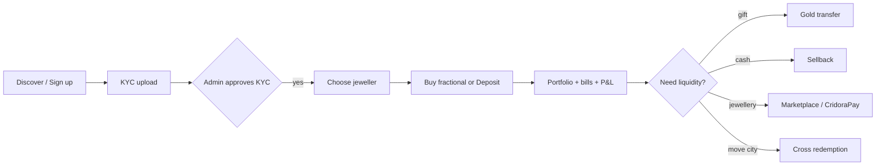
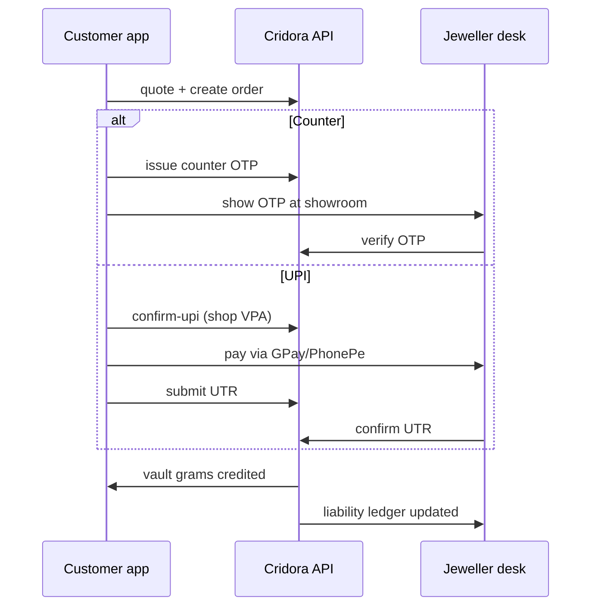

# Cridora — Benefits & Value Proposition

**Use for:** public pages, pitch decks, investor slides, jeweller onboarding, customer campaigns.  
**Basis:** Features **live in the product today** vs **planned** (marked separately so marketing stays honest).  
**Source:** Cridora India codebase (`backend/apps/accounts/`, `frontend/src/features/portfolio/`, `platform_features.py`) — not README summaries.

---

## One-line positioning

| Audience | Line |
|----------|------|
| **Customer** | *Your gold, in grams, with verified jewellers — buy, hold, transfer, and redeem without starting from zero every time.* |
| **Jeweller** | *A digital gold operating layer — custody, sales, redemptions, and discovery — without building your own fintech stack.* |
| **Both** | *India’s jewellery-linked gold platform: real metal, real shops, one trusted network.* |

---

## Why customers should use Cridora

### Core promise

Cridora turns gold saving and jewellery buying into **one connected experience**: grams you can see, jewellers you can trust, and actions (buy, sell, transfer, redeem) from phone or desktop — tied to **physical jewellery culture**, not abstract “points.”

---

### Customer benefits — **live today**

#### Save & grow in real gold

- **Buy gold in small steps** — Start with fractional purchases at a verified jeweller; no need for a large single transaction to begin saving.
- **Hold actual grams, not coupons** — Portfolio shows **weight in grams** and value tied to **live gold reference rates**, not opaque reward balances.
- **One portfolio, many jewellers** — See holdings **custodian-wise** (which shop holds your metal) while still having a **single Cridora view** of total gold.
- **Deposit gold you already own** — Bring verified physical gold into the network via your jeweller; it credits your **digital vault** after intake confirmation.

#### Digital bill vault & purchase records

- **Store purchase bills digitally** — Upload **purchase invoices** (JPG, PNG, PDF) per holding; download anytime from the personal vault. Document types also include certificates, valuation papers, warranty cards, and product photos (`PersonalHoldingDocument`).
- **Smart invoice import** — Photo or PDF of a jeweller bill → **AI-assisted field extraction** (weight, purity, shop name, date, ₹/g) via `/portfolio/invoice-import/analyze/` — reduces manual entry for old bills.
- **Bill breakdown on record** — Each holding can store **metal, making charge, GST on gold/making, and invoice total** — not just a single price (`purchase_bill_breakdown` on personal holdings API).
- **CridoraPay purchases auto-archived** — When a customer pays a jeweller bill through **CridoraPay**, the platform creates a **personal holding + purchase invoice** linked to that transaction (`CridoraPayBill` → `PersonalGoldHolding`).
- **Unified purchase history** — Portfolio **activity ledger** lists fractional buys, deposits, sellbacks, transfers, ornament redemptions, CridoraPay purchases, loans, and manually added personal items (`/portfolio/ledger/`).

#### Personal holdings vault (full gold picture)

- **Record gold outside Cridora custody** — Ornaments, coins, bars bought anywhere (family heirlooms, other shops) as **personal holdings** — weight, purity, purchase date, shop name, notes.
- **Jeweller can add on behalf of customer** — Verified jewellers can record holdings for customers (`/jeweller/personal-holdings/`); admin can verify or moderate.
- **Important distinction** — Personal holdings are **tracking and records only** — not redeemable, transferable, or loanable on the platform (`PersonalGoldHolding` model docstring). Custodial vault grams remain the redeemable layer.
- **Where in app** — Customer dashboard → **Portfolio** → **Personal** tab (`CustomerPersonalHoldingsPanel`).

#### Growth & profit/loss visibility

- **Per-holding gain vs purchase** — Each personal item shows **reference gain in ₹ and %** when purchase price or ₹/g is recorded (`reference_gain_inr`, `reference_gain_percent` vs live 22K reference mark).
- **Portfolio-level personal P&L** — Aggregated **recorded cost basis**, estimated current value, and **total personal gain** on the overview cards (`customer_portfolio_totals_payload`).
- **Custodial vault unrealized P&L** — Fractional vault holdings show **mark-to-market vs allocated purchase cost** (metal value before GST from completed fractional orders) via `portfolio_unrealized` on the wallet API.
- **Combined portfolio view** — Overview can blend **custodial + personal** estimated value and P&L — one screen for “all my gold,” not just Cridora vault grams.
- **Value over time (portfolio chart)** — Historical chart plots **estimated portfolio INR** against **invested baseline** using stored board-rate samples (`PortfolioCharts` — portfolio overview / holdings views). Tint above baseline ≈ unrealized gain at that sample; below ≈ unrealized loss.
- **Compliance note for marketing** — Gains are **indicative** against reference rates and recorded purchase inputs — not guaranteed returns, not tax advice, and not a trading terminal.

#### Trust & safety

- **Verified jeweller network** — Shops go through **KYB**; customers go through **KYC** before key money actions — a baseline trust layer for a high-trust category.
- **Transparent identity** — **Cridora member ID**, **GoldUPI-style handle**, routing code, and **QR** so you know *who* you’re paying or receiving from.

#### Use gold like money — when you need to

- **Sell back for cash** — Redeem grams to cash at your jeweller (counter confirmation or UPI payout path, per shop policy).
- **Send & gift gold** — **Gold transfer** to another customer (including QR scan on mobile) — weddings, family, friends, without only cash gifts.
- **Shop real jewellery** — Browse **marketplace catalogues** from verified jewellers: ornaments, making charges, and pricing visibility before you visit or buy.
- **Redeem vault gold toward jewellery** — Use held grams toward **ornament purchase** (metal + making charge logic on platform) instead of only “paper” balance.

#### Freedom beyond one shop

- **Cross-jeweller emergency redemption** — If life or location changes, **authorize redemption through another partner jeweller** in the network (structured approval flow — not “stuck in one city’s scheme”).
- **Discover & compare jewellers** — Public **directory + storefront pages**: city, policies, rates context, and catalogue — choose where you save and where you redeem.
- **Same-store benefits where offered** — Jewellers can configure **same-store making-charge benefits** on SKUs; platform surfaces this when applicable.

#### Always informed

- **Live gold ticker & history** — Platform and shop rates in context; less guessing on “today’s rate.”
- **Portfolio at a glance** — Overview, vault breakdown, **personal holdings tab**, purchase ledger, and P&L cards — designed for **regular checking**, not annual statements only.
- **Alerts & updates** — Notifications and optional **push** (web / Android app) for rate and platform messages.

#### Access anywhere

- **Web + installable app** — Use in browser; **install as PWA** or **Android app** (Capacitor) for counter, home, and travel.
- **Built for mobile India** — Bottom navigation, mobile transfer flow, barcode/QR scan for payees.

---

### Customer benefits — **coming soon** or **rollout-gated** (verify before broad campaigns)

- **Golden scheme enrollment** — Full enroll / contribute / redeem module exists (`schemes` app + customer `invest_scheme`); **feature flag `golden_scheme` defaults OFF** — confirm admin rollout before marketing as nationwide live.
- **Gold loans** — Full loan compare / quote / repay flow exists (`redeem_loan`, `/gold/loans/*`); **feature flag `gold_loan` defaults ON** — still confirm per-environment rollout and jeweller participation.
- **Sellback UPI payout** — Customer UPI cash-out path exists; **feature flag `sellback_upi` defaults OFF**.
- **Per-item P&L history chart** — Today: **snapshot gain per holding** + **portfolio-level history chart**; not a separate month-by-month chart for each ornament over its lifetime.
- **Auto-capture every partner bill** — CridoraPay bills auto-archive; other shops rely on **upload + smart import** until deeper jeweller POS integration.
- **Card / instant online checkout** — Integrated payment gateway (today: counter OTP and manual UPI + UTR at jeweller; card path is demo).
- **Pick default jeweller in one tap** — Preference APIs exist; streamlined marketplace UI coming.
- **Deeper settlement automation** — Stronger nationwide settlement rails behind cross-redemption (today: in-app saga + operational settlement).

---

### Why a customer *needs* Cridora (problem → outcome)

| Pain today | What Cridora does |
|------------|-------------------|
| Gold stuck in one shop’s scheme | **Network redemption** and **transferable grams** (within verified partners) |
| No single view of “how much gold do I have?” | **Portfolio + vault IDs** across custodians **+ personal holdings vault** |
| Purchase bills lost in drawers | **Digital bill vault** — upload, smart import, CridoraPay auto-archive |
| Can’t see if my gold “grew” | **Per-holding reference gain** + **portfolio unrealized P&L** + history chart vs cost baseline |
| Buying jewellery feels disconnected from saving | **Vault grams → marketplace redemption** path |
| Gifting gold is clumsy (cash or physical only) | **GoldUPI-style transfer + QR** |
| Don’t know which jeweller to trust online | **KYC/KYB + moderated catalogue** |
| Rates and making charges opaque | **Ticker, listings, and storefront transparency** |
| Younger users want digital; shops want footfall | **Digital save at shop, physical redeem at shop** — bridge, not replacement |

---

### Short bullets for slides (customers)

- Real gold in **grams**, not points  
- **Verified** jewellers & **KYC** customers  
- **Buy · Hold · Transfer · Sell · Redeem** in one place  
- **Digital bill vault** — invoices linked to holdings  
- **Personal holdings** — full family gold picture (tracking)  
- **Gain / loss visibility** — per item and portfolio chart  
- **Marketplace** for real ornaments  
- **Cross-jeweller** redemption when life changes  
- **Live portfolio** + gold rate context  
- **Phone-first** — PWA & Android  
- Jewellery culture **respected**, not “crypto gold”  

---

## Why jewellers should use Cridora

### Core promise

Cridora gives independent and regional jewellers **enterprise-style digital gold infrastructure** — customer vaults, purchase verification, sellbacks, marketplace presence, and cross-network redemptions — so they **compete with chains** without a ₹crore IT project.

---

### Jeweller benefits — **live today**

#### Grow & retain customers

- **Nationwide discovery** — **Public directory and storefront** for KYB-verified shops: new customers find you by city, catalogue, and trust signals.
- **Digital gold savers** — Offer **fractional buy** at counter or UPI; young and SIP-style savers enter your ecosystem early.
- **Sticky custody relationship** — Customer metal sits in **vault under your custodianship** — natural reason to return for sellback, deposit, and ornament purchase.
- **Marketplace showcase** — Publish **SKUs** (weight, purity, making charge, stones); admin **moderation** keeps network quality high.

#### Run operations in one dashboard

- **Customer vault hub** — See **custody vaults**, balances, and **per-customer ledger** — less spreadsheet chaos.
- **Approve fractional purchases** — **Counter OTP** or **UPI + UTR confirm** flows; clear pending queues.
- **Gold deposit intake** — Record physical intake; customer confirms via **OTP**; vault credits automatically on verify.
- **Sellback desk** — Accept, reject, complete cash sellback, or **UPI payout** with audit trail.
- **CridoraPay bills** — Issue vault-backed bills at counter; customer payment can **auto-create purchase record + invoice** in their personal vault.
- **Record customer off-vault gold** — Add **personal holdings** on behalf of customers (e.g. documented family jewellery) for a fuller portfolio view.
- **Ornament redemptions** — List when customers redeem vault grams toward **your products**.
- **Transfers & cross-redemption inbox** — Handle **incoming cross-shop redemptions**, source approval OTP, and fulfillment heartbeat — structured, not WhatsApp chaos.

#### Control pricing & commercial terms

- **Your rates, your rules** — Configure **gold rate source**, markups, metal pricing JSON, sellback deductions, and storefront copy.
- **UPI for collections** — Set **shop UPI VPA** for fractional and payout flows aligned with how you already bank.
- **Golden scheme messaging** — Turn on **scheme disclosure** on storefront (duration, minimum monthly, benefits text) to capture scheme-led footfall (full enrollment product roadmap).
- **Same-store perks** — Configure **same-store making-charge benefits** on products to reward loyalty.

#### Risk & books visibility

- **Automatic liability ledger** — Platform tracks **custodial grams owed** and movement on fractional, deposit, sellback, redemption, cross-redemption — audit-friendly starting point.
- **KYB credibility** — Verified badge in directory; customers filter toward approved partners.
- **Admin-backed network** — Platform **freezes bad actors**, **revokes verification**, and **moderates products** — protects reputable shops.

#### Marketing & engagement

- **Festival & rate pushes** — Participate in platform **broadcasts** and rate-alert ecosystem (where configured).
- **Logo, imagery, catalogue** — Upload **brand assets** and product images; professional digital shelf.

#### Technology without a dev team

- **Ready-made jeweller dashboard** — Operations, marketplace, portfolio, profile — **no custom app build**.
- **Android-friendly** — Customers can use native app; you still verify at counter.
- **Aligned with Indian practice** — UPI, OTP at counter, GST context on purchases — not a Western-only wallet clone.

---

### Jeweller benefits — **coming soon** or **rollout-gated**

- **Full golden scheme operations** — Scheme catalog + contributions desk built (`txn_schemes`, `mkt_schemes`); confirm **`golden_scheme` feature flag** before marketing.
- **Gold loan revenue** — Loan desk built (`txn_loans`); jeweller LTV / fee fields on pricing profile; confirm **`gold_loan` rollout** and partner readiness.
- **Treasury & settlement console** — Self-serve view of **inter-jeweller obligations** (backend MVP exists; admin treasury UI roadmap).
- **Programs & risk dashboard** — Network-level program controls for large partners.
- **Deeper trust scores & analytics** — Beyond verification badge (discover copy may tease; not full product).

---

### Why a jeweller *needs* Cridora (problem → outcome)

| Pain today | What Cridora does |
|------------|-------------------|
| Chains have apps; independents don’t | **Turnkey dashboard + marketplace** |
| Customer gold records in notebooks | **Vault + ledger per customer** |
| Lose customer when they move city | **Cross-redemption network** brings them to *a* partner — ideally you as dest/source |
| Online discovery is Instagram-only | **Searchable directory + SKU catalogue** |
| Fractional/digital gold sounds risky | **OTP, KYC, liability tracking** — structured rails |
| Can’t afford fintech build | **SaaS-style platform** on shared infrastructure |
| Younger buyers skip traditional schemes | **Fractional + digital portfolio** meets them where they are |

---

### Short bullets for slides (jewellers)

- **Acquire** customers digitally  
- **Custody vaults** + customer ledger  
- **Verify** buys, deposits, sellbacks in one ops hub  
- **Marketplace** listing & moderated catalogue  
- **Cross-network** redemption revenue & footfall  
- **Your rates**, your UPI, your storefront  
- **Liability tracking** built in  
- **KYB verified** trust in directory  
- No need to **build your own app**  

---

## Side-by-side: who gets what

| Value | Customer | Jeweller |
|-------|----------|----------|
| Real grams & live rates | ✅ | ✅ (pricing tools) |
| Verified network (KYC/KYB) | ✅ | ✅ |
| Fractional purchase | ✅ buy | ✅ verify |
| Physical deposit | ✅ confirm | ✅ intake |
| Sellback / cash out | ✅ | ✅ operate |
| Gold transfer / gift | ✅ | — |
| Marketplace / ornaments | ✅ shop | ✅ sell |
| Cross-jeweller redeem | ✅ authorize | ✅ inbox |
| Portfolio / vault view | ✅ | ✅ per customer |
| **Purchase bills / digital vault** | ✅ upload + CridoraPay | ✅ CridoraPay bills |
| **Personal holdings record** | ✅ | ✅ add for customer |
| **Gain / loss vs purchase** | ✅ per item + portfolio | — |
| **Purchase activity ledger** | ✅ | ✅ customer ledger |
| Digital discovery | ✅ find shops | ✅ be found |
| Push / mobile app | ✅ | ✅ (customer-facing) |
| Golden scheme | ⚠️ flag-gated | ⚠️ flag-gated |
| Gold loans | ⚠️ flag-gated | ⚠️ flag-gated |
| Auto settlement UI | — | 🔜 |

---

## User flows & journeys

**For marketing demos, onboarding scripts, and support playbooks.**  
**Legend:** ✅ live in code · ⚠️ partial / flag-gated · ❌ not implemented  
**Customer dashboard:** `/userdashboard?section=<key>` · **Jeweller:** `/dashboard/jeweller?section=<key>` · **Admin:** `/dashboard/admin?section=<key>`

### Gates (who can do what)

| Gate | Customer | Jeweller |
|------|----------|----------|
| Browse public site | ✅ | ✅ (public storefront when KYB approved) |
| Sign up / log in | ✅ | ✅ apply → dashboard |
| Money movement (buy, sell, transfer, redeem, pay bills) | **KYC verified** | **KYB verified** |
| Visible in directory / transactional with customers | — | **KYB verified** + product moderation where required |

Signup is **email + password** — instant session; **no SMS OTP login** in production APIs today.

---

### End-to-end customer journey (typical happy path)

---

### Payment rails overview

Cridora is **not** a payment-aggregator checkout. Real money moves via **Indian shop practice**: counter OTP, **manual UPI + UTR**, vault gram debit, or cash at counter. **No live card gateway** (marketplace card path is demo only).

| Product flow | Pay at counter (OTP) | UPI + UTR / proof | Vault grams | Cash | Online card |
|--------------|----------------------|-------------------|-------------|------|-------------|
| **Fractional gold buy** | ✅ Customer shows OTP → jeweller verifies | ✅ Customer pays shop UPI → submits UTR → jeweller confirms | — | ✅ Cash at counter | ❌ |
| **Golden scheme contribution** | ✅ Same pattern as fractional | ✅ UPI reconciliation queue | — | — | ❌ |
| **Physical gold deposit** | ✅ Customer OTP after jeweller intake | — | ✅ Credits vault on verify | — | — |
| **Cash sellback** | ✅ Customer OTP at counter to release grams | ⚠️ Jeweller pays customer UPI (`sellback_upi` flag) | ✅ Debited from vault | ✅ Cash payout | — |
| **CridoraPay shop bill** | ✅ Vault OTP at counter | ✅ UPI for balance after vault slice | ✅ Partial/full vault debit | ✅ Cash for remainder | ❌ |
| **Gold loan disburse** | ✅ Customer OTP at jeweller | — | ✅ Collateral locked in vault | ✅ Cash disbursed | — |
| **Gold loan repayment** | ✅ Counter OTP path | ⚠️ UPI repay (`loan_repayment_upi` flag) | — | — | ❌ |
| **Marketplace ornament** | ⚠️ UPI at counter patterns | ⚠️ | ✅ Vault redemption quote API | — | ❌ demo card |
| **Gold transfer (P2P)** | — | — | ✅ Gram move between vaults | — | — |

**UPI reconciliation states** (shared pattern): `pending_payment` → customer submits UTR → `signal_received` / `awaiting_utr_verify` → jeweller confirms or rejects proof → completed or `on_hold` / `proof_rejected` (customer can re-upload). Jeweller **On hold** desk (`txn_on_hold`) handles stuck UPI cases.

**Counter OTP TTL** — Admin configurable (`plat_control` / fractional counter OTP policy; default ~15 minutes).

---

### Public visitor flows

#### Browse & discover ✅

1. Land on `/` or mobile hubs: **Discover**, **Shop**, **Join**, **Gold Rates**.
2. `/jewellers` → directory; `/jewellers/:id` → storefront (KYB-verified shops).
3. `/marketplace` → product catalogue; `/marketplace/product/:id` → SKU detail.
4. `/gold-rates/*`, `/gold-calculator` — rates SEO and estimator (no account).

#### Sign up entry ✅

| Path | Route | Result |
|------|-------|--------|
| Customer | `/signup` → `POST /auth/register/` | JWT → `/userdashboard` |
| Jeweller | `/jeweller/apply` → `POST /auth/jeweller/apply/` | JWT → `/dashboard/jeweller` |
| Login | `/login` → `POST /auth/login/` | Redirect by `user_type` |

#### Waitlist ⚠️

`/waitlist` — mailto / lead form; **no waitlist API** in backend.

---

### Customer flows (by feature)

#### Onboarding & KYC ✅

1. Register → dashboard (often `portfolio_overview` or `profile_kyc` if unverified).
2. **Profile → KYC** (`profile_kyc`): upload Aadhaar, PAN, selfie (`POST /kyc/documents/upload/`); optional bank (`POST /kyc/bank/`).
3. Admin reviews in **users_kyc_kyb** → approve / reject.
4. Until **KYC verified**: fractional buy, sellback, transfers, CridoraPay accept, loans blocked by API.

#### Portfolio & personal vault ✅

**Sections:** `portfolio_overview`, `portfolio_holdings`, `portfolio_vault_ids` · **Personal tab** inside portfolio panel.

1. **Overview** — total grams, custodial + personal INR estimates, unrealized P&L, history chart (`GET /gold/wallet/` embeds `portfolio_unrealized`, portfolio totals).
2. **Vault breakdown** — per-jeweller custodial grams (fractional, deposit, scheme, loan collateral).
3. **Vault IDs** — Cridora member ID, GoldUPI handle, routing code, QR (`GET/PATCH /gold/identity/`).
4. **Personal holdings** — add/edit ornaments off-platform:
   - Manual form **or** **Invoice import** (`POST /portfolio/invoice-import/analyze/` — AI reads bill photo/PDF).
   - Attach **purchase invoice** and other documents per holding.
   - View **reference gain ₹ / %** per item when purchase price recorded.
5. **Activity ledger** — `GET /portfolio/ledger/` — all purchase-related events in one timeline.

#### Buy fractional gold ✅

**Section:** `invest_fractional`

1. Select **KYB-verified jeweller**.
2. Enter ₹ or grams → `POST /fractional/quote/` (rate, GST, total).
3. `POST /fractional/orders/` — create pending order.
4. **Payment path A — Counter:** `POST .../counter-otp/` → customer shows OTP → jeweller `txn_purchases` verifies → vault credited (fractional holding).
5. **Payment path B — UPI:** `POST .../confirm-upi/` → customer pays jeweller VPA → `POST .../submit-utr/` → jeweller confirms UTR on purchase desk → vault credited.
6. Liability ledger updated for jeweller automatically.

#### Physical gold deposit ✅

**Customer:** `invest_deposit` (view intakes) · **Jeweller:** `txn_deposits`

1. Jeweller records intake (weight, purity) → `POST /jeweller/gold-deposit/intakes/`.
2. Customer sees intake → `POST .../counter-otp/`.
3. Jeweller verifies OTP → **deposit** grams credit custodial vault.

#### Golden scheme ⚠️ (`golden_scheme` flag)

**Section:** `invest_scheme` · **Jeweller:** `mkt_schemes`, `txn_schemes`

1. Admin publishes scheme templates (`mkt_programs`).
2. Jeweller adopts offering from catalog → customers see enrollable schemes.
3. Customer **request join** → jeweller admits enrollment (pending → active).
4. Monthly contribution: same **counter OTP or UPI + UTR** pattern as fractional (`schemes/contributions/`).
5. Jeweller schemes desk verifies contributions; progress toward plan month / redemption.

#### CridoraPay (shop bill) ✅ (`corridorapay` flag)

**Customer:** `invest_cridorapay` · **Jeweller:** `txn_cridorapay`

1. Jeweller creates bill at counter (title, weight, purity, total INR) → customer notified.
2. Customer opens bill → `quote` → chooses **vault slice + UPI/cash remainder** (or full vault / full UPI).
3. **Vault portion:** customer issues OTP → jeweller verifies vault OTP → grams debited from custodial vault.
4. **UPI remainder:** customer pays shop VPA → UTR → jeweller marks UPI paid / reconciliation.
5. **Cash remainder:** jeweller marks cash paid at counter.
6. On complete → **personal holding + purchase invoice** auto-created; appears in bill vault and ledger (`cridorapay_purchase`).

#### Gold transfer (GoldUPI) ✅

**Section:** `redeem_transfer`

1. Enter payee GoldUPI / scan QR (`POST /gold/resolve/`).
2. Enter grams → `POST /gold/transfers/` — debit sender vault, credit receiver vault (same or cross-jeweller routing rules).
3. Public pay page: `GET /gold/pay/<gold_upi>/` (metadata for QR landing).

#### Cash sellback ✅

**Section:** `redeem_cash` · **Jeweller:** `txn_ops`

1. Select jeweller custodian → `POST /gold/sellback/quote/` (buyback ₹/g, cash estimate).
2. Choose **cash at counter** or **UPI payout** (if `sellback_upi` enabled) → `POST /gold/sellback/confirm/`.
3. Jeweller **accepts** or rejects on sellback desk.
4. **Cash path:** customer OTP at counter → jeweller completes → vault grams debited.
5. **UPI path:** jeweller pays customer UPI VPA → submits UTR / proof → customer may confirm → complete.
6. Record appears in portfolio ledger (`sellback`).

#### Cross-jeweller emergency redemption ✅

**Section:** `redeem_emergency`

1. Customer authorizes redemption at **destination** jeweller → `POST /cross-redemption/authorize/`.
2. Destination jeweller accepts/rejects inbox (`txn_ops`).
3. **Source** custodian jeweller OTP approval.
4. Fulfillment heartbeat while saga in progress.
5. **Settlement** between jewellers — **manual admin** completion today (`fin_settlement`), not automated bank rails.

#### Gold loan ⚠️ (`gold_loan` flag)

**Section:** `redeem_loan` · **Jeweller:** `txn_loans`

1. Customer compares offers → `POST /gold/loans/compare/` → quote grams / term.
2. `POST /gold/loans/confirm/` → jeweller pending queue.
3. Jeweller accepts → customer **counter OTP** → loan **disbursed** (cash); collateral grams locked in vault.
4. Repayment: counter OTP or UPI repay path (`loan_repayment_upi` flag) → collateral released on full repay.

#### Marketplace shopping ⚠️

**Sections:** `shop_jewellers`, `shop_products` · Public `/marketplace`

1. Browse SKUs (admin-moderated, KYB jewellers).
2. Cart + checkout UI (`MarketplaceCheckoutFlow`).
3. **Vault redemption API** for KYC customers: `POST /marketplace/redemption/quote|confirm/`.
4. **Card checkout = demo only** — not production payment gateway.
5. Real purchases at shop often flow through **CridoraPay** instead.

#### Profile & notifications ✅

| Section | Flow |
|---------|------|
| `profile_personal` | Edit profile, payout UPI for sellback |
| `profile_security` | Password change |
| `profile_kyc` | KYC workflow |
| `profile_cridora_id`, `profile_qr` | Identity display |
| `profile_notifications` | Preferences; web push / FCM on Android |

#### Logout ✅

`POST /auth/logout/` → clear JWT → `/login`.

---

### Jeweller flows (by feature)

#### Onboarding & KYB ✅

1. `/jeweller/apply` → dashboard default `prof_kyb` until verified.
2. Upload GST, PAN, shop proof, etc.
3. Admin **users_kyc_kyb** approves → storefront + transactional visibility.

#### Customer hub ✅ — `cust_hub`

1. List all custody vaults → balances per customer.
2. Drill into **per-customer ledger** (`/jeweller/custody-vaults/<id>/ledger/`).
3. Optional: add **personal holding** for customer documentation.

#### Operations desk ✅ — `txn_*` sections

| Desk | Jeweller actions |
|------|------------------|
| `txn_purchases` | Verify fractional counter OTP; confirm fractional UTR |
| `txn_schemes` | Verify scheme contributions; manage enrollments |
| `txn_deposits` | Create deposit intake; verify customer OTP |
| `txn_ops` | Sellbacks; ornament redemptions; cross-redemption inbox |
| `txn_cridorapay` | Create bills; verify vault OTP; mark UPI/cash paid |
| `txn_loans` | Approve/disburse loans; track repayments |
| `txn_on_hold` | UPI payments needing manual reconciliation |
| `txn_transfers` | Monitor P2P transfers involving their vaults |
| `fin_settlements` | View inter-jeweller settlement obligations (partial UI) |

#### Marketplace setup ✅

1. `mkt_policy` — rates, markups, sellback rules, scheme disclosure text.
2. `mkt_products` — SKU CRUD + images (KYB required for writes).
3. `mkt_schemes` — adopt platform scheme offerings (when flag on).
4. Products need **admin moderation** before network catalog.

#### Referrals ✅ — `cust_referral`

Referral code for customer acquisition (jeweller-side program).

---

### Admin flows (platform operator)

| Area | Section | Flow |
|------|---------|------|
| KYC / KYB | `users_kyc_kyb` | Review docs → approve / reject / revoke / freeze |
| User directories | `users_customers`, `users_jewellers` | Search, drill-down |
| Product moderation | `mkt_products` | Approve / reject SKUs |
| Scheme programs | `mkt_programs` | Publish / deprecate templates; risk controls |
| Platform pulse | `ops_overview` | Stats from `/admin/overview/` |
| Personal vault moderation | `ops_personal_vault` | Verify / remove personal holdings |
| Cross-redemption settlement | `fin_settlement` | Manual settlement-complete |
| Feature rollout | `plat_features` | Toggle `golden_scheme`, `gold_loan`, `sellback_upi`, etc. |
| Gold ticker & rates pages | `plat_gold`, `plat_gold_rates` | Ticker config, gold-rates ads |
| Festival broadcasts | `plat_festival` | Scheduled push campaigns |
| Fractional OTP policy | `plat_control` | Counter OTP TTL |

---

### Flow diagram: fractional purchase (payment detail)

---

### Marketing notes on flows

- Demo **“instant online pay”** only where UPI+UTR or vault OTP applies — always **jeweller confirmation** step.
- **Personal holdings** flow is **self-serve** (no jeweller required) except CridoraPay auto-archive and jeweller-added records.
- For campaign screenshots: **Portfolio → Personal** for bill vault; **Portfolio overview** for P&L chart; **Invest → Fractional** for counter/UPI buy flow.
- Before filming **schemes or loans**, enable flags in **Admin → Control → Feature rollout**.

---

## Suggested homepage sections (copy-ready)

### For customers

**Headline options**

- *Gold savings that move with your life.*  
- *Grams you can trust. Jewellers you can choose.*  
- *From saving in gold to wearing it — one platform.*

**Subhead**

- Buy in small amounts, track live value, transfer to family, and redeem at verified jewellers across India — with real grams, not points.

**CTA pair**

- *Start saving* → `/signup`  
- *Explore jewellers* → `/jewellers`

---

### For jewellers

**Headline options**

- *Your shop’s digital gold layer.*  
- *Retain savers. Reach new buyers. Run vaults digitally.*  
- *Compete with chains — without building an app.*

**Subhead**

- Custody vaults, fractional sales verification, marketplace listings, and cross-network redemptions — in one jeweller dashboard.

**CTA pair**

- *Apply as jeweller* → `/jeweller/apply`  
- *See how it works* → `/how-it-works`

---

## Presentation slide order (10 slides)

1. **Problem** — Gold is trusted; digital is fragmented; schemes lock users to one shop.  
2. **Solution** — Cridora: jewellery-linked gold platform (grams + verified network).  
3. **For customers** — 4–5 bullets from “Customer benefits — live today.”  
4. **Customer journey** — Sign up → KYC → Buy / Deposit → **Record bills & personal gold** → Portfolio P&L → Transfer or Redeem.  
5. **For jewellers** — 4–5 bullets from “Jeweller benefits — live today.”  
6. **Jeweller journey** — Apply → KYB → Catalogue + rates → Ops desk → Cross-redemption.  
7. **Marketplace** — Discovery, SKUs, vault redemption toward ornaments.  
8. **Bill vault & personal portfolio** — Invoices, smart import, per-item gain, history chart.  
9. **Trust** — KYC/KYB, moderation, liability ledger, OTP flows.  
10. **Roadmap** — Per-item lifetime charts, broader auto-bill capture, payment gateway (honest).  
11. **Ask** — Join waitlist / pilot jewellers / download app.

---

## Words to use vs avoid (compliance-friendly)

| Prefer | Avoid (unless live) |
|--------|---------------------|
| Verified jeweller network | “Bank-regulated” (unless licensed) |
| Grams in custodial vault | “Guaranteed returns” |
| Redeem at partner jewellers | “Instant cash in 5 minutes” (unless SLA exists) |
| Cross-jeweller redemption (with approvals) | “Withdraw anywhere instantly” |
| Live reference rates | “Always beats FD returns” |
| Indicative gain vs recorded purchase | “Guaranteed returns” |
| Digital bill vault for records | “Fully insured” (unless policy exists) |
| KYC/KYB verified users | “Bank-regulated” (unless licensed) |
| Platform-assisted emergency redemption | “Withdraw anywhere instantly” |
| Gold loans (when flag enabled) | “Loan approved instantly” (unless SLA exists) |

---

## Aligning with existing Discover page

The app already ships copy in `frontend/src/content/discoverBenefits.ts` and homepage i18n (`idx.bills.*`, `idx.cust.c3desc`). Homepage already claims **digital bill storage** and **growth tracking** — this document now matches what the **portfolio module** actually implements. Some Discover lines still describe **future** capabilities (e.g. zero-interest loans, shared family vaults). For **public/legal-safe pages**, prefer this document’s **“live today”** section; move aspirational lines to a “Coming soon” band or roadmap slide.

---

## Code evidence (for marketing ↔ product alignment)

| Capability | Primary code |
|------------|----------------|
| Personal holdings CRUD + documents | `backend/apps/accounts/models.py` (`PersonalGoldHolding`), `frontend/src/features/portfolio/CustomerPersonalHoldingsPanel.tsx` |
| Invoice AI import | `backend/apps/accounts/invoice_import_views.py`, `frontend/src/features/portfolio/InvoiceImportFlow.tsx` |
| Per-holding gain fields | `reference_gain_inr` / `reference_gain_percent` in personal holdings serializers; UI in `CustomerPersonalHoldingsPanel` |
| Portfolio unrealized P&L (custodial) | `backend/apps/accounts/wallet_extras.py` (`customer_portfolio_unrealized_summary`) |
| Portfolio totals + personal aggregate P&L | `backend/apps/accounts/services/personal_holdings.py` (`customer_portfolio_totals_payload`) |
| Portfolio history chart | `frontend/src/features/portfolio/PortfolioCharts.tsx`, `CustomerPortfolioPanel.tsx` |
| Unified purchase ledger | `customer_portfolio_ledger_payload` → `/portfolio/ledger/` |
| CridoraPay → bill + holding | `CridoraPayBill.purchase_invoice`, `personal_holding` FK on bill model |
| Feature rollout flags | `backend/apps/accounts/platform_features.py` |
| User flow reference (audit) | `docs/audit/USER_FLOWS.md` (supplemented by this section) |
| CridoraPay bill flow | `backend/apps/accounts/corridorapay_views.py`, `CridoraPayBill` model |
| Payment rail shared UPI | `backend/apps/accounts/services/upi_manual_payment/` |

### Why bill vault & personal P&L were missing from earlier versions of this doc

Earlier drafts focused on **custodial vault flows** (fractional, transfer, redeem) and mentioned personal holdings in **one optional bullet**. The **Digital Bill Vault** and **growth/P&L** work lives mainly in the **portfolio feature module**, which shipped after the first marketing pass. Homepage copy already teases bills and growth; this file now documents the same capabilities at benefit depth.

---

*Last updated: 2026-06-23 · Reflects Cridora India codebase (`portfolio/`, `personal_holdings`, `platform_features`, payment views).*
