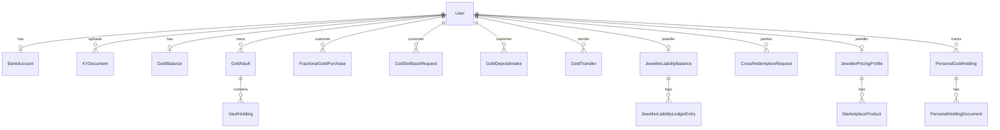

# Cridora India — Database Report

**ORM:** Django models in `apps.accounts` and `apps.marketplace`.  
**Migrations:** accounts 30, marketplace 24.

---

## 1. Entity relationship overview

---

## 2. `accounts` app tables

### User (`accounts_user`)

| Field | Type | Notes |
|-------|------|-------|
| `user_type` | enum | customer, jeweller, admin |
| `phone` | string | |
| `kyc_status` | enum | pending, verified, rejected |
| `kyc_verified_at` | datetime | |
| `cridora_member_id` | string unique | CRI{padded pk} |
| `gold_handle_local`, `gold_routing_code`, `gold_upi` | strings | GoldUPI identity |
| `payout_upi_vpa` | string | Customer sellback payouts |
| `jeweller_code` | string | Storefront slug |
| `default_jeweller`, `jeweller_pref_*` | FK → User | Jeweller preferences |
| Business fields | | business_name, gstin, shop_address, city, state, pincode |

**Indexes:** Unique on `cridora_member_id`, `gold_routing_code`, `gold_upi` when set.

### KYC & banking

| Model | PK | Key relationships |
|-------|-----|---------------------|
| `BankAccount` | id | OneToOne User |
| `KYDocument` | id | FK User; unique (user, doc_type) |

**Doc types:** Customer: aadhaar, pan, selfie_photo. Jeweller: pan_business, gst_certificate, shop_establishment, trade_license, bis_hallmark, incorporation_certificate, partnership_deed, address_proof_shop, proprietor_aadhaar, proprietor_pan, msme_udyam, iec_import_export.

### Vault & balance

| Model | Purpose |
|-------|---------|
| `GoldBalance` | OneToOne User — aggregate redeemable grams |
| `GoldVault` | FK owner (customer), custodian (jeweller); `vault_public_id` |
| `VaultHolding` | FK vault; `holding_type`: fractional, deposit, golden_scheme; `balance_grams` |

**Holdings logic:** Credits/debits per custodian and holding type; `GoldBalance` synced from vault totals.

### Transactions

| Model | Purpose |
|-------|---------|
| `GoldTransfer` | P2P grams between users |
| `FractionalGoldPurchase` | Purchase orders; payment_method upi/counter; status workflow |
| `FractionalCounterOtp` | Hashed OTP for counter payment |
| `GoldSellbackRequest` | Sellback lifecycle; UPI fields |
| `GoldSellbackOtp` | Cash confirmation OTP |
| `GoldDepositIntake` | Physical deposit; purity, reference rate |
| `GoldDepositCounterOtp` | Customer confirmation |
| `VaultProductRedemption` | Marketplace ornament from vault grams |

### Jeweller liability

| Model | Purpose |
|-------|---------|
| `JewellerLiabilityBalance` | OneToOne jeweller — grams owed to platform/customers |
| `JewellerLiabilityLedgerEntry` | Audit trail with `kind` enum (fractional, sellback, deposit, redemption, cross_redemption, rollbacks, etc.) |

### Cross-redemption saga

| Model | Purpose |
|-------|---------|
| `JewellerCrossPolicy` | Per-jeweller caps, reserve, trust tier |
| `CrossRedemptionRequest` | State machine, amounts, jeweller FKs |
| `CrossRedemptionApprovalOtp` | Source jeweller OTP |
| `CrossRedemptionEvent` | Append-only audit |
| `ExposureReservation` | INR exposure hold |
| `CrossRedemptionSagaStep` | Idempotent step tracking |
| `IntegrationOutbox` | Async side effects (**stub processor**) |
| `SettlementBatch` | MVP batch marker |
| `SettlementObligation` | Jeweller-to-jeweller INR obligations |

### Notifications & push

| Model | Purpose |
|-------|---------|
| `WebPushSubscription` | Browser push endpoints |
| `NativePushToken` | FCM device tokens |
| `AdminNotification` / `AdminNotificationRead` | Admin feed |
| `FestivalBroadcastNotification` | Scheduled broadcasts |
| `PortfolioUserNotification` | Customer portfolio inbox |

### Personal portfolio (off-vault)

| Model | Purpose |
|-------|---------|
| `PersonalGoldHolding` | Manual tracking; weight, purity, source; admin verify flag |
| `PersonalHoldingDocument` | File uploads |
| `PersonalPortfolioAuditLog` | Audit trail |

### Operations

| Model | Purpose |
|-------|---------|
| `PlatformOperationalSettings` | Singleton pk=1; fractional OTP TTL |
| `PhoneOTPChallenge` | **Unused** SMS OTP scaffold |

---

## 3. `marketplace` app tables

| Model | Purpose |
|-------|---------|
| `GoldTickerConfig` | Singleton-style platform ticker; live/manual; adjustments JSON; loan/yield APR; `cross_platform_fee_inr` |
| `GoldTickerReferenceHistory` | Historical 22K reference rates |
| `MetalPurity` | slug, fine_fraction, spot_family |
| `ProductCategory` | Catalog categories |
| `JewellerPricingProfile` | 1:1 jeweller — rates, markups, storefront, UPI VPA, golden scheme disclosure, `metal_pricing_json` |
| `MarketplaceProduct` | SKU — weight, making charges, stones, `is_x_redeem`, moderation status |

---

## 4. Business logic summary (data layer)

### Holdings structure

1. Customer has **aggregate** `GoldBalance.balance_grams`.
2. Grams are split across **vaults** (one per custodian jeweller).
3. Each vault has **holdings by type** (fractional vs deposit vs golden_scheme).
4. Fractional purchases credit **fractional** holding; deposits credit **deposit** type.

### Liability tracking

When custodial gold increases at a jeweller, **JewellerLiabilityBalance** increases with matching **ledger entries**. Sellbacks and redemptions reduce liability. Provides audit trail for B2B settlement (manual MVP).

### Redemption

- **Sellback:** Debit vault → reduce liability → payout record (cash/UPI).
- **Ornament:** `VaultProductRedemption` links product, grams debited, making charges in INR.
- **Cross-redemption:** Moves obligation between jewellers via `CrossRedemptionRequest` + settlement obligations.

### Default jeweller

`User.default_jeweller` FK used in routing, marketplace, and GoldUPI suffix (`@jewellercode`). Preference FKs for nearby/ornament/redemption — stored but limited UI.

### Unique IDs

| ID | Format | Assignment |
|----|--------|------------|
| Member ID | `CRI0000000123` | post_save signal on User |
| Vault public ID | Generated in vault_service | Per vault |
| Routing code | 10-digit random | User.gold_routing_code |
| GoldUPI | `handle@jewellercode` | Normalized lowercase |

### Transfer system

`GoldTransfer` records sender/receiver, grams, optional custodian context; validates balances before debit.

---

## 5. Schema risks & scalability

| Risk | Detail |
|------|--------|
| No read replicas config | Single Postgres connection pool via `conn_max_age=600` |
| File uploads on local disk | `FileSystemStorage` — needs persistent volume on Railway |
| Large JSON on jeweller profile | `metal_pricing_json` — validate size |
| Saga/outbox tables unbounded | Needs retention policy |
| `golden_scheme` holding type without flow | Could confuse reporting |
| Duplicate ticker markup fields | Deprecated `admin_markup_*` superseded by JSON adjustments |
| No row-level security | App-layer auth only |

### Unused / duplicate concerns

- `PhoneOTPChallenge` — unused table
- No duplicate user tables; single `User` model for all roles

---

*APIs touching these tables: [API_REPORT.md](./API_REPORT.md).*
