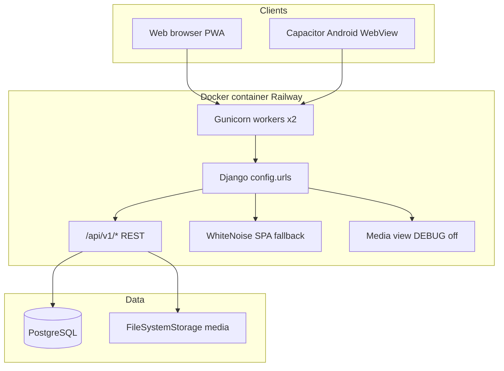
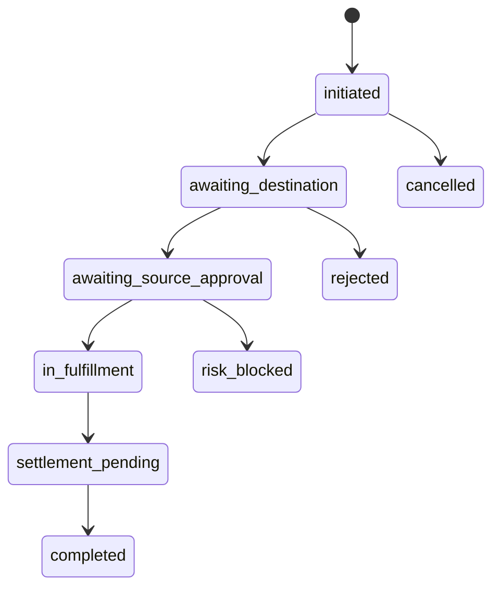

# Cridora India — System Architecture

**Audit basis:** Implemented code in `backend/` and `frontend/`.

---

## 1. High-level topology



---

## 2. Backend structure

### 2.1 Django project (`backend/config/`)

| File | Role |
|------|------|
| `settings.py` | DB, JWT, CORS, media, VAPID, Firebase |
| `urls.py` | `/api/v1/` includes, `/admin/`, SPA catch-all, `/media/` |
| `views.py` | `spa_index` — serves `index.html` for non-API routes |
| `wsgi.py` | Gunicorn entry |

### 2.2 Apps

#### `apps.accounts` (core domain)

**Responsibilities:** Users, KYC/KYB, vault, fractional/sellback/deposit, cross-redemption saga, personal portfolio, notifications, push subscriptions.

**Layering pattern:**

```
views*.py / *_views.py  →  thin APIView
        ↓
*_service.py, services/*  →  business logic, transactions
        ↓
models.py  →  persistence
```

**No `selectors/` layer** — ORM queries live in services/views.

**Key service packages:**

| Path | Purpose |
|------|---------|
| `vault_service.py` | Vault creation, holdings, balance sync |
| `fractional_service.py` | Quote, order, completion |
| `sellback_service.py` | Sellback lifecycle |
| `gold_deposit_completion.py` | Deposit vault credit |
| `jeweller_liability_service.py` | Custodial liability ledger |
| `services/cross_redemption/*` | Saga, transitions, limits, outbox (stub) |
| `services/personal_holdings.py` | Off-vault holdings |
| `services/kyc_review.py` | Admin review helpers |
| `webpush_service.py`, `fcm_service.py` | Push delivery |

#### `apps.marketplace`

**Responsibilities:** Gold ticker, spot price fetch/cache, metal purities, product catalog, jeweller pricing profiles, vault ornament redemption pricing.

| Module | Purpose |
|--------|---------|
| `spot_prices.py` | External XAU/USD-INR fetch + cache |
| `metal_pricing.py`, `pricing.py` | SKU price computation |
| `redemption_views.py` | Quote/confirm vault redemption |
| `redemption_cross_bridge.py` | Link to cross-redemption when needed |
| `gold_rate_alerts.py` | Threshold push cron |
| `gold_hourly_push.py` | Hourly rate push cron |

### 2.3 Migrations

| App | Count | Range |
|-----|-------|-------|
| accounts | 30 | `0001_initial` … `0030_sellback_upi` |
| marketplace | 24 | `0001_initial` … `0024_jewellerpricingprofile_upi_vpa` |

---

## 3. Frontend structure

```
frontend/src/
├── App.tsx                 # Router only
├── main.tsx                # PWA register, providers
├── context/                # AuthContext, ThemeContext
├── pages/                  # Route-level pages
├── pages/dashboard/        # Role dashboards (section-driven)
├── features/               # Domain UI modules
├── components/             # Layout, chrome, shared UI
├── lib/                    # API clients, nav config, utilities
└── styles/index.css        # Global design system
```

**Routing model:** Few React Router paths; dashboards use **`?section=<key>`** query param with nav configs in `src/lib/mobileNav/`.

**Build modes:**

| Mode | Router | `base` | Notes |
|------|--------|--------|-------|
| Web dev | BrowserRouter | `/` | Vite proxy `/api` → :8000 |
| Web prod | BrowserRouter | `/` | `VITE_API_BASE_URL` baked in |
| Capacitor | HashRouter | `./` | `VITE_CAPACITOR_BUILD=true` |

---

## 4. Authentication architecture

```
Login/Register
     → access_token + refresh_token (JSON)
     → localStorage
     → Authorization: Bearer on authFetch
     → 401 → POST /auth/token/refresh/ → retry once
Logout → blacklist refresh token
```

**Not used for API:** Django session cookies (sessions exist for `/admin/` only).

---

## 5. Realtime & polling

| Feature | Mechanism | Realtime? |
|---------|-----------|-----------|
| Gold ticker / spot prices | HTTP fetch; cron updates DB | **Static/polled** — client refetch on navigation |
| Dashboard wallet | `GET /gold/wallet/`, `/auth/me/` | **Poll on focus/interval** in panels — no WebSocket |
| Notifications (logged in) | `GET /notifications/` or `/admin/notifications/` | **Poll** when bell opens |
| Cross-redemption status | REST + jeweller heartbeat endpoint | **Semi-realtime** — heartbeat POST, not WS |
| Web Push / FCM | Server push on events | **Push** when subscribed |
| Gold rate alerts | Management command cron | **Batch** |

**No WebSocket implementation** in codebase.

---

## 6. Notification architecture

```
Event (signal/service)
    → AdminNotification / PortfolioUserNotification / push payload
    → Optional: webpush_service / fcm_service
    → Client: NotificationBell polls API OR mock (guest)
```

| Feed | API | When |
|------|-----|------|
| Customer/jeweller platform | `GET /api/v1/notifications/` | Authenticated |
| Admin | `GET /api/v1/admin/notifications/` | Platform admin |
| Guest/public header | `mockNotifications.ts` | **Not live** |

**Festival broadcasts:** `FestivalBroadcastNotification` + `process_festival_broadcasts` cron.

---

## 7. Cross-redemption saga (architectural)



- **ExposureReservation** holds INR exposure during flow.
- **CrossRedemptionSagaStep** tracks idempotent steps.
- **IntegrationOutbox** — **STUB** (marks DONE without HTTP).
- **SettlementObligation** — manual MVP completion via admin API + management command.

---

## 8. External integrations (actual)

| Integration | Status |
|-------------|--------|
| PostgreSQL | Production |
| Spot price APIs | Used in `spot_prices.py` (cached) |
| Web Push (VAPID) | Optional env keys |
| Firebase FCM | Optional `FIREBASE_SERVICE_ACCOUNT_JSON` |
| Payment gateway | **None** |
| SMS OTP provider | **None** |
| Email (SMTP) | **None** in settings |
| Jeweller external gold API URL | Field stored, **not fetched** |

---

## 9. Code quality & maintainability

### Strengths

- Clear split `accounts` vs `marketplace`.
- Service modules for complex flows (fractional, sellback, cross-redemption).
- Frontend feature folders mirror domains.
- Legacy section key maps preserve old URLs.

### Technical debt

| Issue | Location |
|-------|----------|
| No shared DRF permission classes | All views use inline checks |
| Demo data merged in production UI | `*MarketplaceDemos.ts` |
| Dead component | `CustomerVaultRedemptionShopPanel` not routed |
| Large dashboard page files | `AdminDashboardPage.tsx` (~900+ lines) |
| No React Query | Manual fetch/error state per panel |
| Duplicate path casing in workspace | `cridoraindia` vs `corridoraindia` folder names |

### Test coverage

`backend/apps/accounts/tests/` — auth, fractional UPI, sellback UPI, cross-redemption tiers, redemption bridge, admin discretionary, MVP alignment. **No marketplace app tests found.**

---

## 10. Management commands (operations)

| Command | Purpose |
|---------|---------|
| `create_cridora_superadmin` | Bootstrap admin user |
| `seed_test_users` | Demo data (dev) |
| `generate_vapid_keys` | Web Push keys |
| `process_festival_broadcasts` | Scheduled push sends |
| `run_gold_rate_alerts` | Rate threshold notifications |
| `run_hourly_gold_push` | Hourly gold push |
| `cross_redemption_timeout_sweep` | Expire stale requests |
| `cross_redemption_recover_sagas` | Saga recovery |
| `cross_redemption_process_outbox` | Outbox stub processor |
| `cross_redemption_run_settlement_mvp` | MVP settlement batch |

Documented for Railway Cron: gold alerts, festival broadcasts, hourly push.

---

*See [API_REPORT.md](./API_REPORT.md) and [DATABASE_REPORT.md](./DATABASE_REPORT.md) for endpoint and schema detail.*
